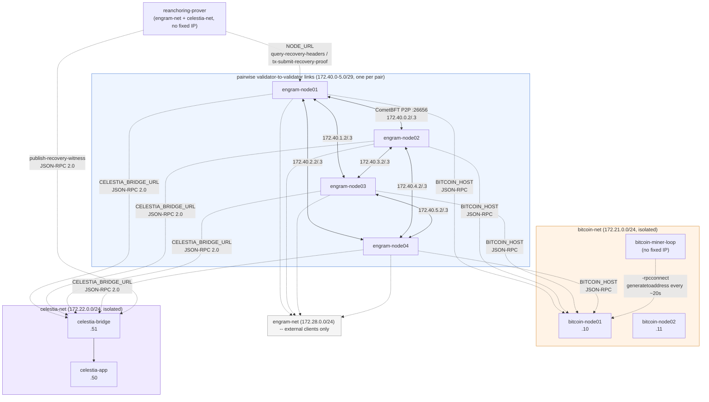

# Infrastructure Architecture

This document describes the REAL, currently-running Docker Compose network/container topology —
validator/Bitcoin/Celestia networking and port allocation. Refreshed whenever the topology changes, verified against
`docker/*.yml` and `compose.yml`.

## 1. Network Topology

| Network | CIDR | Gateway | Isolation | Members |
|---|---|---|---|---|
| `validator-link-NN-MM` (×6) | `172.40.<0-5>.0/29` | `.1` | one pair only | the 2 validators of that pair, `.2`/`.3` |
| `engram-net` | `172.28.0.0/24` | `.1` | external clients | 4 validators `.100`/`.110`/`.120`/`.130`, + `reanchoring-prover` (no fixed IP) |
| `bitcoin-net` | `172.21.0.0/24` | `.1` | isolated | `bitcoin-node01` `.10`, `bitcoin-node02` `.11`, `bitcoin-miner-loop` (no fixed IP), + validators `.100`/`.110`/`.120`/`.130` |
| `celestia-net` | `172.22.0.0/24` | `.1` | isolated | `celestia-app` `.50`, `celestia-bridge` `.51`, + validators `.100`/`.110`/`.120`/`.130`, + `reanchoring-prover` (no fixed IP) |

**Key facts:**

* Validators gossip over each peer's literal pairwise-link IP (`cmd/engramd/main.go`'s
  `pairwiseLinkPeerIP`), not an `engram-net` hostname -- this is why `SubnetDiversity`
  (`x/sovereignty/types/subnet.go`'s `SubnetOf`) reads 3 genuinely distinct `/29` subnets per
  validator, not 1.
* `engram-net` carries everything that isn't P2P gossip: `reanchoring-prover`'s RPC client, the
  attacker swarm (`docs/EXPERIMENT.md`'s §3); validators stay multi-homed onto it alongside their
  pairwise links and `bitcoin-net`/`celestia-net`. It sits on `172.28.0.0/24` to avoid colliding
  with a pre-existing `kind` network on the dev host (`CLAUDE.md`'s M6 notes).
* `bitcoin-miner-loop`/`reanchoring-prover` are real, always-on containers (`make testnet-up`, not
  profile-gated), replacing a host `nohup` process and a manual script invocation. Neither needs a
  static IP -- both only make outbound RPC calls. `reanchoring-prover` also writes each accepted
  proof's header-chain witness straight to `celestia-bridge`, since `HeaderHistory` (the on-chain
  copy) gets pruned once the proof lands -- an audit trail, never verified on-chain
  (`x/sovereignty/keeper/msg_server.go`'s `RecoveryProofDAHeights`).
* Profile-gated fault-injection services (attacker swarm, double-signing harness) get extra
  `engram-net` IPs plus their own isolated subnets, only while their Compose profile is active --
  see `docs/EXPERIMENT.md`'s §3 for which profiles exist and what each is used for.

**Routing note:** Docker's default-route ambiguity for multi-homed containers doesn't affect
validator P2P -- each pairwise link is a directly-connected `/29`, so the kernel always routes a
dial to a peer's pairwise-link IP over that link, regardless of default-route priority. It does
matter for off-link traffic (`BITCOIN_HOST`/`CELESTIA_BRIDGE_URL` resolution): declaring
`bitcoin-net`/`celestia-net` after `engram-net` in each service's `networks:` block is what makes
those hostnames resolve at all.

## 2. Port Allocation

Each validator uses offset ports to avoid host collisions -- only **host-mapped** ports differ,
every container listens on the same in-network ports. All 4 are defined in
`docker/engram-validator-cluster.yml` (one YAML-anchor-templated file; see it for the shared base
and per-node overrides).

| Node | Engram RPC | Cosmos REST | CometBFT metrics |
|---|---|---|---|
| `engram-node01` | `26657` | `1317` | `26660` |
| `engram-node02` (+100) | `26757` | `1417` | `26760` |
| `engram-node03` (+200) | `26857` | `1517` | `26860` |
| `engram-node04` (+300) | `26957` | `1617` | `26960` |

`CometBFT metrics` is CometBFT's own Prometheus `/metrics` endpoint -- always on, but unscraped: no
prometheus/grafana stack exists here. Every E2-E9 experiment number instead comes from
`scripts/framework/logger.py` polling CometBFT RPC/ABCI-query directly.

| External service | Compose file | Port |
|---|---|---|
| `bitcoin-node01` RPC | `docker/bitcoin-regtest-cluster.yml` | `18443` |
| `bitcoin-node02` RPC | `docker/bitcoin-regtest-cluster.yml` | `19443` |
| `celestia-app` RPC | `docker/celestia-local-cluster.yml` | `26658` |
| `celestia-app` gRPC | `docker/celestia-local-cluster.yml` | `9090` |
| `celestia-bridge` RPC | `docker/celestia-local-cluster.yml` | `26658` (distinct container from `celestia-app`, same in-network port) |

No per-validator "Celestia Light RPC" port exists -- there's no light-client hop in this
deployment; `x/da`'s `Publisher`/`RPCClient` talk to `celestia-bridge` directly.
