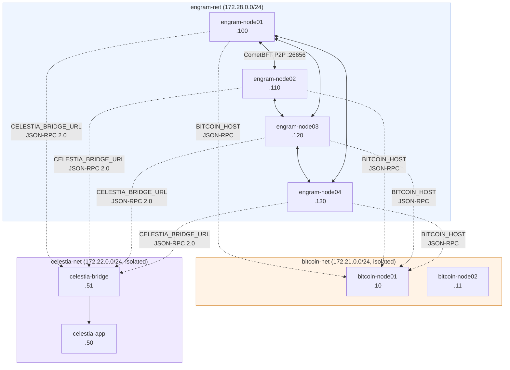
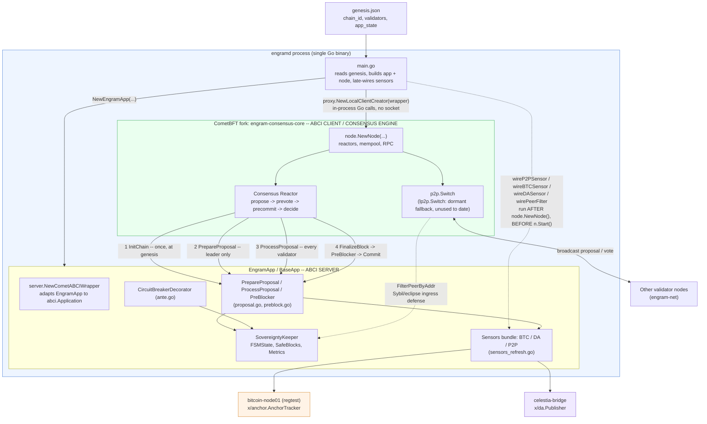
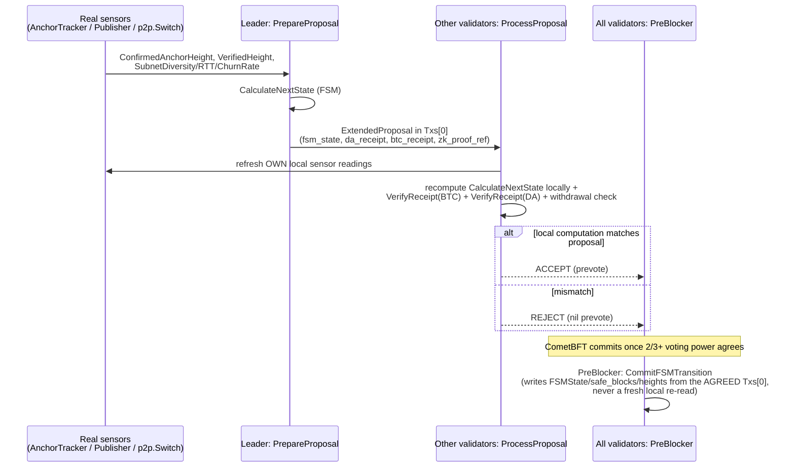

# Infrastructure Architecture

This document describes the REAL, currently-running Docker Compose topology and the ABCI++
mechanism actually implemented in this repo. This file is a structural snapshot, refreshed
whenever the topology changes materially, verified directly against the live 4-node testnet,
`docker/*.yml`, and `compose.yml`.

## 1. Network Topology

| Network | CIDR | Gateway | Isolation | Members |
|---|---|---|---|---|
| `engram-net` | `172.28.0.0/24` | `.1` | shared P2P | 4 validators: `.100`/`.110`/`.120`/`.130` |
| `bitcoin-net` | `172.21.0.0/24` | `.1` | isolated | `bitcoin-node01` `.10`, `bitcoin-node02` `.11`, + validators `.100`/`.110`/`.120`/`.130` |
| `celestia-net` | `172.22.0.0/24` | `.1` | isolated | `celestia-app` `.50`, `celestia-bridge` `.51`, + validators `.100`/`.110`/`.120`/`.130` |

Each `engram-nodeNN` is multi-homed across all three networks so its hostname-based env vars --
`BITCOIN_HOST=bitcoin-node01`, `CELESTIA_BRIDGE_URL=http://celestia-bridge:26658` -- resolve via
Docker's embedded DNS; those hostnames only exist on `bitcoin-net`/`celestia-net`, not
`engram-net`. `engram-net` sits on `172.28.0.0/24` specifically to avoid colliding with a
pre-existing `kind` (Kubernetes-in-Docker) network on the development host (`CLAUDE.md`'s M6
notes).

Profile-gated fault-injection services (attacker swarm, duplicate-signing harness) get additional
IPs on `engram-net` plus their own isolated subnets -- listed in §5, not here, since they only
exist when their Compose profile is active.

**Operational note:** for a multi-homed container with no explicit `gw_priority`, Docker's default
outbound route prefers the network declared **second** in that service's `networks:` block, not
the first -- so the 4 validators (`engram-net` declared first, `bitcoin-net` second) reach each
other via their `172.21.0.0/24` addresses, not `172.28.0.0/24`. This affects
`x/sovereignty/keeper/peer_filter.go`'s `FilterPeerByAddr` and `vanillaP2PHealthAdapter`'s
`SubnetDiversity` reading, but is a Docker Desktop routing quirk, not a bug in either: the filter
enforces its subnet cap (`Params.MaxPeersPerSubnet`) correctly regardless of which subnet peers
actually arrive from. Full writeup:
`scripts/e4_p2p_eclipse_detection/results_live/sybil_attack_live_run_20260808_summary.md`.

## 2. Port Allocation

Each validator uses offset ports to avoid host collisions; only **host-mapped** ports differ --
every container listens on the same in-network ports.

All 4 validators are defined in `docker/engram-validator-cluster.yml` (one file, YAML-anchor templated
-- see that file for the shared base and per-node overrides).

| Node | Engram RPC | Cosmos REST | CometBFT metrics |
|---|---|---|---|
| `engram-node01` | `26657` | `1317` | `26660` |
| `engram-node02` (+100) | `26757` | `1417` | `26760` |
| `engram-node03` (+200) | `26857` | `1517` | `26860` |
| `engram-node04` (+300) | `26957` | `1617` | `26960` |

`CometBFT metrics` is CometBFT's own built-in Prometheus-format `/metrics` endpoint
(`[instrumentation] prometheus = true`) -- free/always-on, but nothing currently scrapes it: no
`prometheus`/`grafana` stack exists in this deployment. Every E2-E9 experiment number comes from
`scripts/`'s Python framework polling CometBFT RPC/ABCI-query directly
(`scripts/framework/logger.py`).

| External service | Compose file | Port |
|---|---|---|
| `bitcoin-node01` RPC | `docker/bitcoin-regtest-cluster.yml` | `18443` |
| `bitcoin-node02` RPC | `docker/bitcoin-regtest-cluster.yml` | `19443` |
| `celestia-app` RPC | `docker/celestia-local-cluster.yml` | `26658` |
| `celestia-app` gRPC | `docker/celestia-local-cluster.yml` | `9090` |
| `celestia-bridge` RPC | `docker/celestia-local-cluster.yml` | `26658` (distinct container from `celestia-app`, same in-network port) |

There is no "Celestia Light RPC" port per validator -- no light-client hop exists in this
deployment; `x/da`'s `Publisher`/`RPCClient` talk to `celestia-bridge` directly.

## 3. Sensor Architecture

All sensors are real, live connections, not mocks (Phase 7; `CLAUDE.md`'s "Current status" has
build state):

* **BTC** (`x/anchor.AnchorTracker`, linked directly into `engramd` via `main.go`'s
  `wireBTCSensor`): talks to a real `bitcoind` regtest node over JSON-RPC (`x/anchor/rpc.go`)
  -- submits real OP_RETURN checkpoint transactions, tracks real confirmation depth. No separate
  Submitter/Reporter container exists (this app has no staking module to source a real
  Babylon-style BLS-aggregated checkpoint from).
* **DA** (`x/da.Publisher`, linked in via `wireDASensor`): talks to a real `celestia-bridge` over
  JSON-RPC 2.0 (`x/da/rpc.go`) -- submits real blobs, confirms real retrievability via
  `blob.GetAll`.
* **P2P** (`vanillaP2PHealthAdapter`): reads real, live data from the running `*p2p.Switch`
  (`SubnetDiversity`, `ActiveAnchors`, `CleanPeers`, `ChurnRate`, `AvgTenure`) plus real per-peer
  RTT, piggybacked on `MConnection`'s existing `PacketPing`/`PacketPong` keep-alive exchange
  (`engram-consensus-core`'s `p2p/conn/connection.go`) -- no new reactor.
* **Ingress filter** (`x/sovereignty/keeper/peer_filter.go`'s `FilterPeerByAddr`): an active
  defense, not passive detection -- rejects a new peer connection outright (via
  `baseapp.SetAddrPeerFilter`, a stock Cosmos SDK ABCI hook, no fork changes needed) once
  admitting it would push its `/24` (`/48` for IPv6) subnet's connected-peer count past
  `Params.MaxPeersPerSubnet`. Demonstrated live against a 10-22-container attacker swarm (§5).
* **Verification layer** (`x/da`/`x/anchor`'s `VerifyReceipt` functions): stateless packages,
  not Cosmos SDK modules with their own keeper/KVStore -- port `IsValidProposal`'s DA-pipeline and
  BTC-settlement checks (`spec/core/EngramTendermint.tla:290-298`) directly, called from
  `x/sovereignty/proposal.go`'s `ProcessProposal`.

## 4. Consensus-Layer Integration (as implemented -- NOT ABCI++ Vote Extensions)

### Process wiring: EngramApp (ABCI server) <-> CometBFT fork (ABCI client)

This diagram is the process-level complement to the per-block sequence diagram below: how the
single `engramd` binary links `x/sovereignty`'s `EngramApp` (ABCI *server*) to the
`engram-consensus-core` fork (ABCI *client* / consensus engine), and when each wiring step happens
(`cmd/engramd/main.go`).

The ABCI boundary is in-process, not a socket: `main.go` passes
`proxy.NewLocalClientCreator(server.NewCometABCIWrapper(engramApp))` into `node.NewNode(...)`, so
every ABCI call below is a direct Go function call. `wireP2PSensor`/`wireBTCSensor`/
`wireDASensor`/`wirePeerFilter` run after `node.NewNode()` returns but before `n.Start()` --
`Sensors.P2P` and the ingress filter start on static/fail-open defaults and only get upgraded to
real sources in that window, never mid-proposal (`app.go`'s `Sensors` field doc). `wireP2PSensor`
tries the fork's `lp2p.Switch` first, falling back to the standard `p2p.Switch` via
`vanillaP2PHealthAdapter` -- every real deployment to date takes the fallback path (§3 above), so
the diagram marks `p2p.Switch` primary and `lp2p.Switch` dormant.

### Per-block ABCI++ message flow

"Sensors propose, consensus decides": a node's own sensor readings only ever influence what
**that node proposes or votes on**; the only state that ever gets committed is whatever the
agreed block's `Txs[0]` says, written identically by every honest validator in `PreBlocker`.

The actual mechanism (`x/sovereignty/proposal.go`, `preblock.go`):

* **`PrepareProposal`:** the leader computes `target_state` via `keeper.CalculateNextState`
  (mirrors `ServerInsertProposal`, `spec/core/EngramServer.tla:52-102`), builds
  `da_receipt`/`btc_receipt`/`zk_proof_ref`, JSON-encodes them as an `ExtendedProposal`, and
  prepends it as `Txs[0]` of the block -- a leading pseudo-transaction, not a vote extension.
  `zk_proof_ref` is a hash commitment (`rt_new`, the accepted proof's attested state root), not a
  bare bool -- refines `spec/core/EngramTendermint.tla:150`'s abstract `BOOLEAN`; see
  `spec/README.md` §6.1.
* **`ProcessProposal`:** every validator decodes `Txs[0]` and re-validates it against its own
  local `CalculateNextState` + `x/da.VerifyReceipt` + `x/anchor.VerifyReceipt` + the
  withdrawal circuit breaker (mirrors `IsValidProposal`, `spec/core/EngramTendermint.tla:281-307`),
  rejecting the whole proposal on any mismatch. If `ENGRAM_BYZANTINE_BEHAVIOR` is set on a
  validator (`docker/engram-node04-byzantine.yml` -- never set on a real validator),
  `PrepareProposal` deliberately corrupts its own claim (fake `fsm_state`, forged BTC hash, false
  DA attestation, or censored tx) to exercise this rejection path live, for docs/EXPERIMENT.md's
  E8 attack-resilience rows.
* **`PreBlocker`:** once the block is decided, this is the only place `FSMState`/`safe_blocks`/
  `suspicious_duration`/the tracked heights are actually written, using the *agreed-upon* `Txs[0]`
  (mirrors `ServerUponProposalInPrecommitNoDecision`, `spec/core/EngramServer.tla:135-189`) --
  never recomputed locally. It also reads `RequestFinalizeBlock.Misbehavior` (CometBFT's stock
  evidence-pool report of detected double-signing) and commits it to queryable state
  (`Keeper.DetectedEvidenceCount`/`LastDetectedEvidence`) -- safe because `Misbehavior` is part of
  the already-agreed block request, deterministic across every honest validator, unlike a live
  local sensor read (see `x/sovereignty/preblock.go`'s doc for why raw P2P/BTC/DA sensor values
  are never committed this way).

This mechanism was a deliberate simplification to avoid needing a full TxConfig/signing pipeline
for leader-computed system data. See `x/sovereignty/proposal.go`'s package comment for the
tradeoff and what would be needed to move to real Vote Extensions.

## 5. Fault-Injection Infrastructure (`docs/EXPERIMENT.md`'s E2-E9)

Beyond the 4-validator + Bitcoin + Celestia core, several profile-gated Compose services exist
purely for live experiment data collection -- never started by a plain `docker compose up`:

* **Pumba chaos profiles** (`compose.yml`'s `pumba-*`): `chaos-delay`/`chaos-loss`/`chaos-crash`/
  `chaos-eclipse` (network delay/loss/kill/isolate on `engram-node*`), plus `chaos-btc-delay`
  (delay on `bitcoin-node01`, for E2's S2/E9).
* **`docker/attacker-peer-swarm.yml`** (E4/E8's A1/A2): non-validator `engramd` full nodes whose
  only job is dialing a target validator aggressively. A1 leg: `attacker-a1-01..10` at
  `172.28.0.201-210` (peer-slot-exhaustion). A2 leg: `attacker-a2-*` (dynamic), also attached to
  its own `attacker-subnet-a/b/c/d` (`172.30-33.0.0/24`, profile-gated) but reachable via
  `engram-net` too, per §1's routing note.
* **`docker/engram-node04-byzantine.yml`** (E8's A3/A4/A6/A7): override applied via
  `docker compose -f compose.yml -f docker/engram-node04-byzantine.yml` (never included
  by default) that sets `ENGRAM_BYZANTINE_BEHAVIOR` on node04's real environment.
* **`docker/engram-node04-double-sign.yml`** (E8's Double-signing, `172.28.0.220`): a
  second process holding node04's real signing key but a separate `priv_validator_state.json`, to
  produce a genuine double-sign for CometBFT's stock evidence pool to detect.

`scripts/framework/{logger,injector}.py` are the shared Python primitives every live-data
collection script in `scripts/e*/` builds on. See `docs/EXPERIMENT.md` for what each experiment
group measures and `scripts/*/results_live/` for real, dated output.
