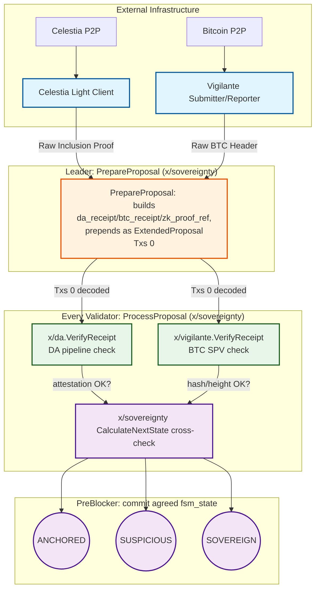
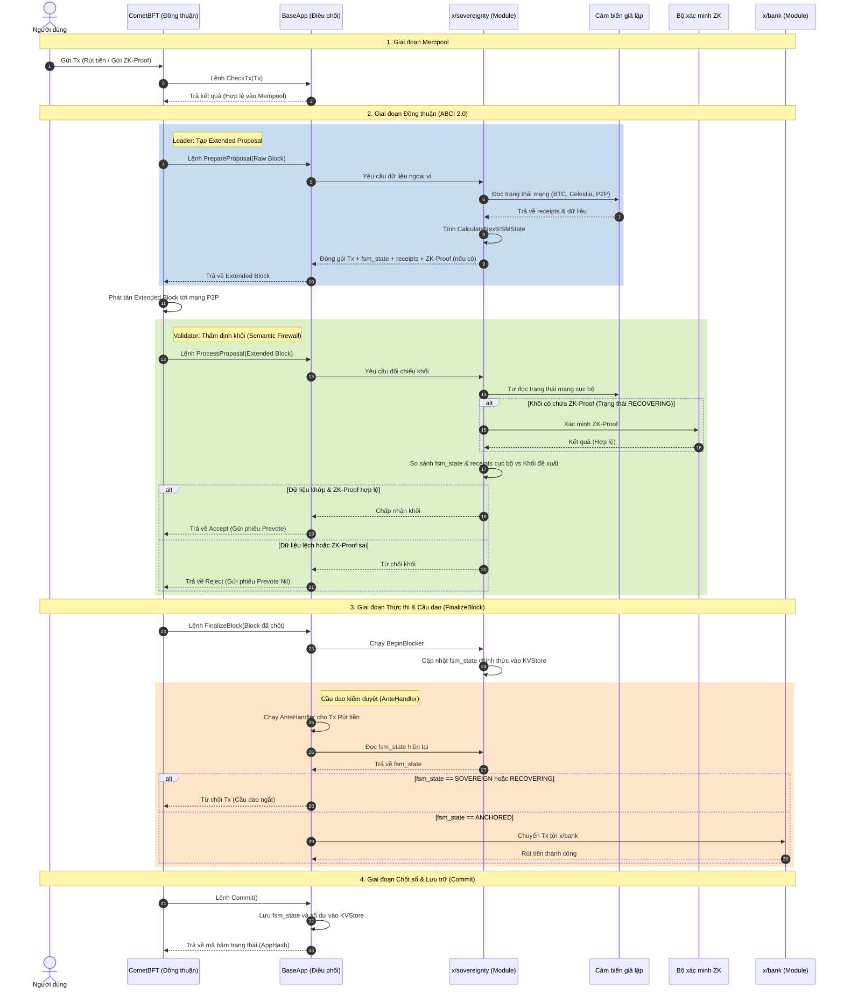

# Infrastructure Architecture

## High-Level Architecture (Mermaid Diagram)

### Validator Node Structure (Mermaid Diagram)

### IP Addressing Scheme

```
Network: 172.20.0.0/24 (engram-net) - Main Validator Network
├── Gateway: 172.20.0.1
├── Shared Services (172.20.0.10-172.20.0.30)
│   ├── Prometheus: 172.20.0.20
│   ├── Grafana: 172.20.0.21
│   └── Reserved: 172.20.0.22-172.20.0.30
└── Validators (172.20.0.100+)
    ├── Validator 0: 172.20.0.100-172.20.0.109
    ├── Validator 1: 172.20.0.110-172.20.0.119
    ├── Validator 2: 172.20.0.120-172.20.0.129
    └── Validator 3: 172.20.0.130-172.20.0.139

Network: 172.21.0.0/24 (bitcoin-net) - Bitcoin Network [ISOLATED]
├── Gateway: 172.21.0.1
├── Bitcoin Node 1: 172.21.0.10
├── Bitcoin Node 2: 172.21.0.11 (optional)
├── Validator 0 services: 172.21.0.100-172.21.0.102
├── Validator 1 services: 172.21.0.110-172.21.0.112
├── Validator 2 services: 172.21.0.120-172.21.0.122
└── Validator 3 services: 172.21.0.130-172.21.0.132

Network: 172.22.0.0/24 (celestia-net) - Celestia DA Layer [ISOLATED]
├── Gateway: 172.22.0.1
├── celestia-app: 172.22.0.50
├── celestia-bridge: 172.22.0.51
├── celestia-light-0: 172.22.0.100
├── celestia-light-1: 172.22.0.101
├── celestia-light-2: 172.22.0.102
└── celestia-light-3: 172.22.0.103
```

*(IP addressing verified against `docker/celestia-local-cluster.yml`/`docker/engram-validator-node0{1-4}.yml` -- celestia-app/celestia-bridge corrected from an earlier stale draft; `celestia-light-N` and the validator ranges were already accurate.)*

### Port Allocation

Each validator uses offset ports to avoid conflicts:

```
Validator 0:  (engram-validator-node01.yml)
├── Engram RPC:      26657  (exposed)
├── Cosmos REST API:   1317   (exposed)
├── Prometheus:        26660  (exposed)
└── Celestia Light RPC: 26658 (exposed)

Validator 1:  (engram-validator-node02.yml)  [Offset +100]
├── Engram RPC:      26757  (exposed)
├── Cosmos REST API:   1417   (exposed)
├── Prometheus:        26760  (exposed)
└── Celestia Light RPC: 26758 (exposed)

Validator 2:  (engram-validator-node03.yml)  [Offset +200]
├── Engram RPC:      26857  (exposed)
├── Cosmos REST API:   1517   (exposed)
├── Prometheus:        26860  (exposed)
└── Celestia Light RPC: 26759 (exposed)

Validator 3:  (engram-validator-node04.yml)  [Offset +300]
├── Engram RPC:      26957  (exposed)
├── Cosmos REST API:   1617   (exposed)
├── Prometheus:        26960  (exposed)
└── Celestia Light RPC: 26760 (exposed)

Bitcoin Network (isolated, not exposed):
├── bitcoin-node-01 RPC: 18443
├── ZMQ Raw Block:       28332
└── ZMQ Raw Tx:          28333
```


## Draft Proposal

Here is the concise summary of the Engram Protocol's modular architecture and Finite State Machine (FSM) design, written in professional English without icons.

# Engram Protocol: Sovereign FSM and Modular Architecture

## 1. The Tripartite Sensor Architecture

*(Status as actually implemented through M4 -- see `CLAUDE.md`'s "Current status" for what's still pending.)*

* **External Infrastructure (Docker Containers):** `celestia-light-client` and the `vigilante-*` containers act as network interfaces (see `docker/engram-validator-node0{1-4}.yml`). They are not yet wired to feed real data into `x/sovereignty`'s sensors -- today's sensors (`x/sovereignty/keeper/sensors/`) are mock-controlled for testing (see M0a in `CLAUDE.md` for the P2P-telemetry gap specifically).
* **Verification Layer (`x/da`, `x/vigilante`):** these are **stateless verification packages**, not full Cosmos SDK modules with their own keeper/KVStore. `x/da.VerifyReceipt`/`x/vigilante.VerifyReceipt` port `IsValidProposal`'s DA-pipeline and BTC-settlement checks (`spec/core/EngramTendermint.tla:290-298`) directly; they're called from `x/sovereignty/proposal.go`'s `ProcessProposal` handler, not from an independent module pipeline.
* **Consensus Core (`x/sovereignty`'s ABCI++ hooks):** see §2 below for the actual mechanism -- it is deliberately simpler than full ABCI++ Vote Extensions.

## 2. Consensus-Layer Integration (as implemented -- NOT ABCI++ Vote Extensions)

An earlier draft of this document described `ExtendVote`/`VerifyVoteExtension` wiring. **That was never built and is not the current design.** The actual mechanism (`x/sovereignty/proposal.go`, `preblock.go`):

* **`PrepareProposal`:** the leader computes `target_state` via `keeper.CalculateNextState` (mirrors `ServerInsertProposal`, `spec/core/EngramServer.tla:52-102`), builds `da_receipt`/`btc_receipt`/`zk_proof_ref`, JSON-encodes them as an `ExtendedProposal`, and prepends it as `Txs[0]` of the block -- a leading pseudo-transaction, not a vote extension.
* **`ProcessProposal`:** every validator decodes `Txs[0]` and re-validates it against its own local `CalculateNextState` + `x/da.VerifyReceipt` + `x/vigilante.VerifyReceipt` + the withdrawal circuit breaker (mirrors `IsValidProposal`, `spec/core/EngramTendermint.tla:281-307`), rejecting the whole proposal on any mismatch.
* **`PreBlocker`:** once the block is decided, this is the only place `FSMState`/`safe_blocks`/`suspicious_duration`/the tracked heights are actually written, using the *agreed-upon* `Txs[0]` (mirrors `ServerUponProposalInPrecommitNoDecision`, `spec/core/EngramServer.tla:135-189`) -- never recomputed locally at this point.

This was a deliberate simplification to avoid needing a full TxConfig/signing pipeline for leader-computed system data. See `x/sovereignty/proposal.go`'s package comment for the tradeoff and what would be needed to move to real Vote Extensions.

## Architecture Flow Diagram



*(This diagram was corrected to match the actual `PrepareProposal`/`ProcessProposal`/`PreBlocker` mechanism -- see §2 above. The class names `core`/`app`/`fsm` are pre-existing style hooks in this file's `classDef`s, not references to Vote Extensions.)*


