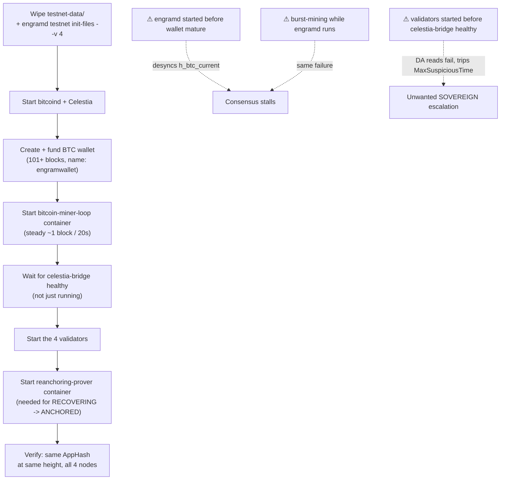
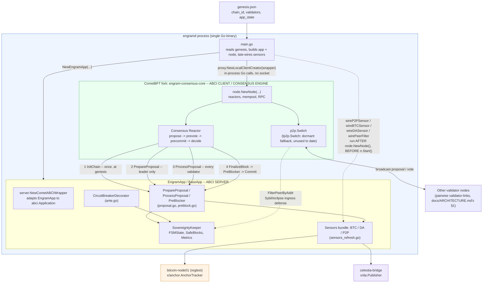
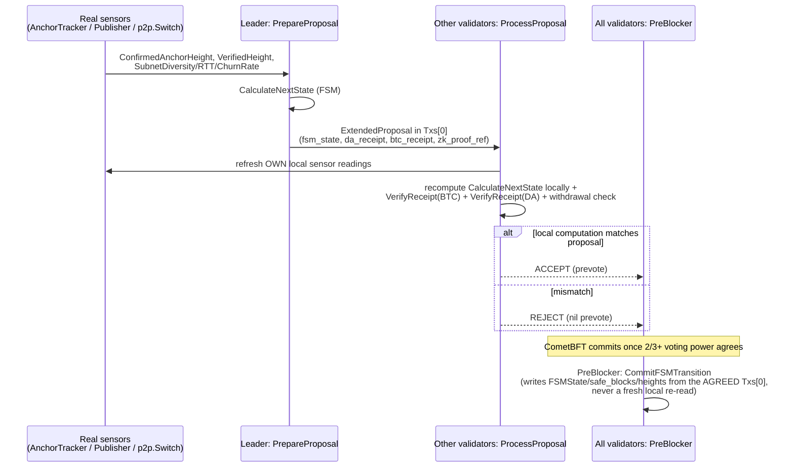
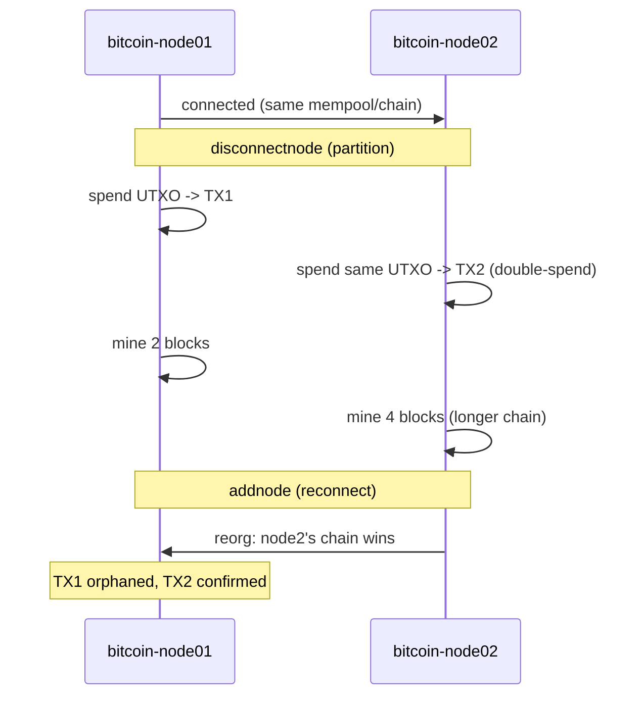

# Development Guide

This is the operating and engineering handbook for the Engram Sovereign FSM repository: how to
build, test, run, and debug it, and how the consensus machinery actually works. It reads best
front-to-back once — each section builds on the previous ones — and then as a reference at the
section you need.

Three companion documents hold the parts this one doesn't:

| Document | Covers |
|---|---|
| `docs/ARCHITECTURE.md` | The Docker Compose network/container topology: ports, IPs, networks |
| `docs/EXPERIMENT.md` | The E1–E10 experiment suite: what each experiment measures, which numbers are real live-Docker data vs. in-process vs. synthetic |
| `CLAUDE.md` | Spec-fidelity rules for touching any FSM/consensus code — read before editing `x/sovereignty`, `x/da`, `x/anchor` |

**Reading map:**

| Section | What you'll learn |
|---|---|
| §1 What this system is | The idea in one page: FSM states, the two load-bearing rules |
| §2 Prerequisites | What to install, including the CometBFT fork sibling |
| §3 Build, test, lint | The command reference + two traps that break CI |
| §4 Run a single local node | The 3-command smoke test, no Docker |
| §5 Run the 4-node Docker testnet | The real cluster: one-command path, manual walkthrough, params, gotchas |
| §6 ZK re-anchoring pipeline | How RECOVERING → ANCHORED actually happens |
| §7 How consensus works | The sensor model, `Txs[0]` mechanism, the three ABCI++ hooks, wiring diagrams |
| §8 Experiments & fault injection | Chaos profiles, byzantine/attacker infra, experiment scripts |
| §9 Debug Bitcoin regtest in isolation | Fork/reorg/double-spend walkthrough for `x/anchor` SPV |
| §10 Troubleshooting quick reference | Symptom → where to look |

---

## 1. What this system is

Engram is a Cosmos SDK + CometBFT prototype implementing **Hybrid Adaptive Consensus**: peripheral
network health — Bitcoin settlement finality, Celestia DA availability, P2P health — is treated as
a first-class consensus variable. When those layers degrade, the chain does not halt; it degrades
gracefully through an FSM into a local-PoS "Sovereign" fallback, then recovers via a ZK
re-anchoring proof.

### The FSM states

| State | Meaning | Withdrawals | Block production |
|---|---|---|---|
| `ANCHORED` | All peripherals healthy, checkpoints settling | enabled | full |
| `SUSPICIOUS` | Warning-level degradation (BTC gap growing, DA gap, partial P2P loss) | enabled, forced-tx queue rate-limited | moderate / full |
| `SOVEREIGN` | Hard failure (BTC gap past threshold, sustained DA failure, total anchor isolation) | locked | full, local |
| `RECOVERING` | Peripherals recovered, recovery proof not yet accepted | locked until anchored | full |

(The precise withdrawal/block-production policy per (BTC, DA, P2P) health combination is
`docs/EXPERIMENT.md` §4 E3's lookup table — not repeated here.)

### The two load-bearing rules

Everything below is in service of these two constraints. They are the reason the code is shaped
the way it is, and the two most common sources of consensus bugs when violated:

1. **"Sensors propose, consensus decides."** FSM state is written only by `CommitFSMTransition`
   (`x/sovereignty/preblock.go`), from the already-agreed proposal — never recomputed from a node's
   own live sensors inside committed state. (`x/sovereignty/abci.go`'s `BeginBlocker` is a separate,
   simplified path used only by the in-process `tests/e2e` harness.)
2. **Never write live local sensor reads into committed/hashed state.** A `PreBlocker` that calls
   `RefreshMetrics` makes each validator's local P2P/BTC view part of `AppHash`, and validators
   with even slightly different local readings diverge — this caused a real consensus failure. Only
   `ext.BTCReceipt` / `ext.DAReceipt` (already-agreed proposal data) are safe to commit.

---

## 2. Prerequisites

| Requirement | Needed for | Notes |
|---|---|---|
| Go toolchain + `make` | build / test / lint | |
| **CometBFT fork sibling** — `../engram-consensus-core` | any build / test / lint here | see warning below |
| Docker Compose v2 | the 4-node Docker testnet | |
| `buf` + `protoc-gen-go` + `protoc-gen-go-grpc` on PATH | `make proto-gen` | |
| `nargo` 1.0.0-beta.22 (+ `bb`, Barretenberg) | `make zk-compile`; debugging the ZK pipeline | not needed for normal runs — the prover runs as a container |
| Python 3.11 or 3.12 | `scripts/` (experiments, plotting) | see §3 |

### This repo needs a sibling checkout of its CometBFT fork

`go.mod` has `replace github.com/cometbft/cometbft => ../engram-consensus-core` — a local sibling
repo, not a module dependency. Any build/test/lint here needs `../engram-consensus-core` to exist.
CI clones it in a pinned step; see `.claude/skills/github-actions-ci/SKILL.md` rule 6 before
touching those workflows (`actions/checkout`'s `path:` cannot check out a sibling repo — tried,
confirmed broken).

If you're changing the fork itself, build/test it directly in `engram-consensus-core` first (its
own module) — this repo's `go build` only consumes the fork's code via `replace`, it doesn't build
the fork.

---

## 3. Build, test, lint

| Command | What it does |
|---|---|
| `make build` | builds `build/engramd` (host OS/arch) |
| `make build-linux` | builds `build/engramd-linux` (for the Docker images) |
| `make test` | `go test -v -race ./...` |
| `make lint` | `golangci-lint run` (needs golangci-lint v2+, see `.golangci.yml`) |
| `make proto-gen` | regenerates `x/sovereignty/types/*.pb.go` (needs `buf`, `protoc-gen-go*`) |
| `make zk-compile` | compiles the Noir circuit (needs `nargo` on PATH) |
| `go build ./... && go vet ./... && go test ./...` | the no-`make` equivalents |
| `golangci-lint run` | the no-`make` lint |

**Ordering:** run `go vet` before `go test` — it's cheap, CI-enforced, and easy to miss inside a
passing test run's output.

**Pointer trap to avoid:** proto types (`x/sovereignty/types/*.pb.go`) embed a `sync.Mutex`. Always
pass `*PeripheralMetrics`, never the value type — `go vet` catches most but not all misuses.

### Python scripts (`scripts/`)

```bash
python -m venv .venv
source .venv/bin/activate
pip install -r requirements.txt

black scripts/       # run before committing, not just black --check
flake8 scripts/
```

`black --check` fails on the whole tree, not just files you touched, and CI won't tell you which
ones until it runs. Format the whole tree locally first.

---

## 4. Run a single local node (no Docker)

```bash
go build -o build/engramd ./cmd/engramd
./build/engramd init my-node
./build/engramd start              # real path: PrepareProposal/ProcessProposal/PreBlocker
./build/engramd start --vanilla    # baseline comparison, skips the ExtendedProposal hooks
```

* `start` reads `config.toml` from disk (`loadConfig`, viper-based) — per-node settings (ports,
  peers) come from there, not hardcoded defaults.
* Without `BITCOIN_HOST` / `CELESTIA_BRIDGE_URL` set (see `.env.example`), the BTC/DA sensors fall
  back to static mocks — fine for a quick smoke test, not for exercising the real sensor-driven
  FSM.
* `--vanilla` never wires `PreBlocker`, so `FSMState` stays at its genesis value (`ANCHORED`) no
  matter what BTC/DA/P2P health actually is — that's the point of the baseline.

---

## 5. Run the real 4-node Docker testnet

### 5.1 What you get

* 4 real validators (`engram-node01..04`) with real ABCI++ hooks.
* Real `bitcoind` regtest (2 nodes) with a continuous miner loop (~1 block / 20s).
* Real Celestia (`celestia-app` + `celestia-bridge`, plus a second bridge backing the prover's
  audit trail).
* The ZK re-anchoring prover container.
* Pairwise validator gossip links (topology/IPs: `docs/ARCHITECTURE.md`).

This is the setup behind every E2–E9 live-data result in `docs/EXPERIMENT.md`.

### 5.2 The one-command path: `make testnet-up` / `make testnet-down`

`make testnet-up` automates the whole manual walkthrough of §5.3 with the correct ordering: wipes
`testnet-data/`, regenerates fresh genesis, funds a mature BTC wallet, starts the miner loop,
fetches both Celestia bridges' admin JWTs into `.env`, waits for `celestia-bridge` to actually be
healthy (not just running), then starts the 4 validators and the re-anchoring prover. It honors `ENGRAM_PARAM_*` in `.env` (§5.4) and requires `.env` to exist
(`cp .env.example .env` and fill in `BITCOIN_RPC_USER`/`BITCOIN_RPC_PASSWORD` first).

`make testnet-down` stops the core services **by name** — never a bare `docker compose down`
(see §5.5). `make testnet-status` is `docker compose ps`.

Operational targets (`make help` lists all):

| Target | Effect |
|---|---|
| `byzantine-on BEHAVIOR=...` | swap node04 for a byzantine build (E8's A3/A4/A6/A7) |
| `byzantine-off` | revert node04 to honest |
| `double-sign-on` / `double-sign-off` | duplicate-key double-signing harness (E8) |
| `timeout-flood-on [INTERVAL_MS=...]` / `timeout-flood-off` | node04 floods signed Timeout msgs (E8) |
| `chaos-delay` / `-loss` / `-crash` / `-eclipse` / `-btc-delay` | start a Pumba fault profile (§8) |
| `chaos-stop` | stop all Pumba profiles |
| `chaos-wan-latency` / `chaos-wan-loss` / `chaos-wan-stop` | per-validator WAN realism profiles (§8) |
| `attacker-a1-up` / `-down`, `attacker-a2-up` / `-down` | E4/E8 attacker swarm (§8) |

### 5.3 The manual walkthrough — the order is load-bearing, not a preference

Starting `engramd` before Bitcoin has a funded, mature wallet — or mining in bursts while `engramd`
is already running — desyncs `h_btc_current` from `h_btc_anchored` past `anchor.VerifyReceipt`'s
tolerance window and stalls consensus permanently.



```bash
# 5.3.1 — fresh genesis (always start clean; see the gotcha below for why)
cp .env.example .env    # fill in BITCOIN_RPC_USER/PASSWORD
rm -rf testnet-data/
make build-linux
./build/engramd testnet init-files --v 4

# 5.3.2 — Bitcoin + Celestia, wallet funded and mature, BEFORE any engramd container.
# -f compose.yml, not a standalone -f docker/*.yml: bitcoin-net/engram-net are only
# declared in compose.yml's own top-level networks:, and an explicit -f opts out of
# Compose's default auto-discovery of compose.yml from cwd.
docker compose --env-file .env -f compose.yml up -d bitcoin-node01 bitcoin-node02
docker compose --env-file .env -f compose.yml up -d celestia-app celestia-bridge
  # (make testnet-up also starts celestia-bridge-2 here and fetches both bridges' admin JWTs)

docker exec -it bitcoin-node01 bitcoin-cli -regtest -rpcuser=$BITCOIN_RPC_USER \
  -rpcpassword=$BITCOIN_RPC_PASSWORD createwallet "engramwallet"   # must be this name --
                                                                      # bitcoin_miner_loop.sh
                                                                      # hardcodes it
addr=$(docker exec -it bitcoin-node01 bitcoin-cli -regtest -rpcuser=$BITCOIN_RPC_USER \
  -rpcpassword=$BITCOIN_RPC_PASSWORD -rpcwallet=engramwallet getnewaddress)
docker exec -it bitcoin-node01 bitcoin-cli -regtest -rpcuser=$BITCOIN_RPC_USER \
  -rpcpassword=$BITCOIN_RPC_PASSWORD -rpcwallet=engramwallet generatetoaddress 101 $addr
  # 101: coinbase needs 100 confirmations before it's spendable

docker compose --env-file .env -f compose.yml up -d bitcoin-miner-loop
  # steady cadence from here on, never manual bursts -- containerized
  # (docker/bitcoin-miner-loop.yml), no host process/PID file anymore

./scripts/testnet_wait_healthy.sh celestia-bridge
  # its auth-token file (needed above) lands within seconds of container
  # start, well before header.NetworkHead RPC calls actually succeed --
  # starting validators on that weaker signal reliably trips
  # MaxSuspiciousTime and forces an unwanted SOVEREIGN escalation on every
  # fresh deploy (confirmed live: ~40-60s gap between the two)

# 5.3.3 — the 4 validators
docker compose --env-file .env -f compose.yml up -d --build engram-node01 engram-node02 engram-node03 engram-node04

# 5.3.4 — the ZK re-anchoring prover (needed for RECOVERING -> ANCHORED; without
# it zk_proof_ref stays null forever and the FSM can never leave RECOVERING)
docker compose --env-file .env -f compose.yml up -d --build reanchoring-prover
```

Verify: `curl -s http://localhost:26657/status | jq .result.sync_info`, and confirm the `AppHash`
matches across all 4 nodes at the same height.

### 5.4 Changing `x/sovereignty.Params` (thresholds, hysteresis, peer limits, ...)

`Params` (`x/sovereignty/types/params.go`) is a consensus-critical value — every validator must
compute an identical `expectedState` from the same sensor reading, so it is **genesis-configured**,
not read from each node's own `.env` at `start` time. (A per-process env var could silently diverge
between validators; genesis is generated once and copied identically to all 4 nodes.)

* Set `ENGRAM_PARAM_<FIELD>` in `.env` before `make testnet-up` (or before `engramd init` /
  `testnet init-files` run directly) — see `.env.example` for the full list of 19 fields and their
  `DefaultParams()` values.
* `engramd testnet init-files` / `init` read these, fall back to `DefaultParams()` per-field when
  unset, and reject the whole genesis with a clear error (`Params.Validate`) if the result violates
  a documented cross-field constraint (e.g. `SOVEREIGN_THRESHOLD` not exceeding
  `SUSPICIOUS_THRESHOLD`) — invalid input fails genesis generation, never a silently-deployed
  unsafe chain.
* `start` never reads `ENGRAM_PARAM_*` itself; it only ever loads whatever landed in
  `genesis.json`.

### 5.5 Gotchas

**`priv_validator_state.json` blocks restarts.** CometBFT's `FilePV` refuses to sign a vote for a
round lower than its last-signed one. Restarting a container against a leftover
`priv_validator_state.json` (no matching fresh WAL) reliably stalls consensus. Fix: always wipe
`testnet-data/` and regenerate genesis (§5.3.1) before every redeploy — this is standing practice,
not a one-off workaround.

**A bare `docker compose ... down` destroys everything.** `down` (no service arguments) tears down
the **entire compose project**, ignoring any `--profile` filter used earlier — profiles only scope
`up`'s defaults, not `down`. A bare `down` can destroy a live running cluster mid-experiment. To
tear down a profile-gated extra (attacker swarm, byzantine override, etc.), always name the
services explicitly:

```bash
docker compose stop <service names>
docker compose rm -f <service names>
```

Never a bare `down`.

Same trap, different command: `docker compose --profile X stop`/`rm -f` with **no service names**
also scopes to the whole project, not just profile `X`'s own containers — `--profile` only widens
what `up`'s bare defaults include, it does not narrow `stop`/`rm`'s scope. Hit this for real
stopping a chaos-wan profile mid-run; see the Makefile's `chaos-wan-stop` target for the fix
(always pass explicit service names).

---

## 6. ZK re-anchoring pipeline (RECOVERING → ANCHORED)

Runs automatically as the `reanchoring-prover` container (`docker/reanchoring-prover/`, started by
`make testnet-up`) — no host `nargo`/`bb` install needed for normal use. The manual, host-side path
below is for debugging the pipeline in isolation; it needs `nargo` + `bb` (Barretenberg) on `PATH`,
pinned to `1.0.0-beta.22`.

```bash
./scripts/reanchoring_prover/prove_and_submit.sh    # one-shot: query -> witness -> prove -> submit
./scripts/reanchoring_prover/watch_and_prove.sh      # continuous, used by several live E2/E9 runs
```

Manual steps, if not using the wrapper:

```bash
./build/engramd query-recovery-headers
./build/engramd tx-submit-recovery-proof --proof <file> --public-inputs <file>
```

**Known limitation:** the circuit's `N` (chained headers per proof) is fixed at compile time
(currently 4) — this only works when exactly `N` headers are tracked. Proving takes real time
(tens–hundreds of ms, see E6), so a proof can go stale mid-flight while the interval keeps growing
underneath it. That's the anti-replay check (`RealProofSubmittedHeight`) working correctly, not a
bug — submit while the interval is stable, don't race a growing one.

---

## 7. How consensus works under the hood

### 7.1 The core idea: "Sensors propose, consensus decides"

A node's own sensor readings only ever influence what **that node proposes or votes on**; the only
state that ever gets committed is whatever the agreed block's `Txs[0]` says, written identically by
every honest validator in `PreBlocker`. No live local read ever lands in committed state (§1).

### 7.2 The three real sensors (+ the ingress filter + the verification layer)

All sensors are real, live connections, not mocks:

* **BTC** (`x/anchor.AnchorTracker`, linked directly into `engramd` via `main.go`'s
  `wireBTCSensor`): talks to a real `bitcoind` regtest node over JSON-RPC (`x/anchor/rpc.go`) —
  submits real OP_RETURN checkpoint transactions, tracks real confirmation depth. No separate
  Submitter/Reporter container exists (this app has no staking module to source a real
  Babylon-style BLS-aggregated checkpoint from).
* **DA** (`x/da.Publisher`, linked in via `wireDASensor`): talks to a real `celestia-bridge` over
  JSON-RPC 2.0 (`x/da/rpc.go`) — submits real blobs, confirms real retrievability via
  `blob.GetAll`.
* **P2P** (`vanillaP2PHealthAdapter`): reads real, live data from the running `*p2p.Switch`
  (`SubnetDiversity`, `ActiveAnchors`, `CleanPeers`, `ChurnRate`, `AvgTenure`) plus real per-peer
  RTT, piggybacked on `MConnection`'s existing `PacketPing`/`PacketPong` keep-alive exchange
  (`engram-consensus-core`'s `p2p/conn/connection.go`) — no new reactor.
* **Ingress filter** (`x/sovereignty/keeper/peer_filter.go`'s `FilterPeerByAddr`): an active
  defense, not passive detection — rejects a new peer connection outright (via
  `baseapp.SetAddrPeerFilter`, a stock Cosmos SDK ABCI hook, no fork changes needed) once admitting
  it would push its `/24` (`/48` for IPv6) subnet's connected-peer count past
  `Params.MaxPeersPerSubnet`. Demonstrated live against a 10–22-container attacker swarm
  (`docs/EXPERIMENT.md`'s §3).
* **Verification layer** (`x/da`/`x/anchor`'s `VerifyReceipt` functions): stateless packages, not
  Cosmos SDK modules with their own keeper/KVStore — they port `IsValidProposal`'s DA-pipeline and
  BTC-settlement checks (`spec/core/EngramTendermint.tla:290-298`) directly, called from
  `x/sovereignty/proposal.go`'s `ProcessProposal`.

### 7.3 The proposal mechanism: a `Txs[0]` pseudo-transaction, not Vote Extensions

The leader computes the target FSM state, encodes it together with the DA/BTC receipts and a ZK
proof reference as an `ExtendedProposal` (JSON), and prepends it as `Txs[0]` of the block — a
leading pseudo-transaction. This was a deliberate simplification to avoid needing a full
TxConfig/signing pipeline for leader-computed system data. See `x/sovereignty/proposal.go`'s
package comment for the tradeoff and what would be needed to move to real Vote Extensions.

### 7.4 The three ABCI++ hooks

* **`PrepareProposal`** (leader only): computes `target_state` via `keeper.CalculateNextState`
  (mirrors `ServerInsertProposal`, `spec/core/EngramServer.tla:52-102`), builds
  `da_receipt`/`btc_receipt`/`zk_proof_ref`, JSON-encodes them as an `ExtendedProposal`, and
  prepends it as `Txs[0]`. `zk_proof_ref` is a hash commitment (`rt_new`, the accepted proof's
  attested state root), not a bare bool — it refines `spec/core/EngramTendermint.tla:150`'s
  abstract `BOOLEAN`; see `spec/README.md` §6.1.
* **`ProcessProposal`** (every validator): decodes `Txs[0]` and re-validates it against its own
  local `CalculateNextState` + `x/da.VerifyReceipt` + `x/anchor.VerifyReceipt` + the withdrawal
  circuit breaker (mirrors `IsValidProposal`, `spec/core/EngramTendermint.tla:281-307`), rejecting
  the whole proposal on any mismatch. If `ENGRAM_BYZANTINE_BEHAVIOR` is set on a validator
  (`docker/engram-node04-byzantine.yml` — never set on a real validator), `PrepareProposal`
  deliberately corrupts its own claim (fake `fsm_state`, forged BTC hash, false DA attestation, or
  censored tx) to exercise this rejection path live, for `docs/EXPERIMENT.md`'s E8 attack rows.
* **`PreBlocker`** (after the block is decided): the only place `FSMState`/`safe_blocks`/
  `suspicious_duration`/the tracked heights are actually written, using the *agreed-upon* `Txs[0]`
  (mirrors `ServerUponProposalInPrecommitNoDecision`, `spec/core/EngramServer.tla:135-189`) — never
  recomputed locally. It also reads `RequestFinalizeBlock.Misbehavior` (CometBFT's stock
  evidence-pool report of detected double-signing) and commits it to queryable state
  (`Keeper.DetectedEvidenceCount`/`LastDetectedEvidence`) — safe because `Misbehavior` is part of
  the already-agreed block request, deterministic across every honest validator, unlike a live
  local sensor read.

### 7.5 Process wiring: EngramApp (ABCI server) ↔ CometBFT fork (ABCI client)

How the single `engramd` binary links `x/sovereignty`'s `EngramApp` (ABCI *server*) to the
`engram-consensus-core` fork (ABCI *client* / consensus engine), and when each wiring step happens
(`cmd/engramd/main.go`).

The ABCI boundary is in-process, not a socket: `main.go` passes
`proxy.NewLocalClientCreator(server.NewCometABCIWrapper(engramApp))` into `node.NewNode(...)`, so
every ABCI call is a direct Go function call. `wireP2PSensor`/`wireBTCSensor`/`wireDASensor`/
`wirePeerFilter` run after `node.NewNode()` returns but before `n.Start()` — `Sensors.P2P` and the
ingress filter start on static/fail-open defaults and only get upgraded to real sources in that
window, never mid-proposal (`app.go`'s `Sensors` field doc). `wireP2PSensor` tries the fork's
`lp2p.Switch` first, falling back to the standard `p2p.Switch` via `vanillaP2PHealthAdapter` —
every real deployment to date takes the fallback path (§7.2), so the diagram marks `p2p.Switch`
primary and `lp2p.Switch` dormant.



### 7.6 Per-block ABCI++ message flow



---

## 8. Live experiments & fault injection

### 8.1 The experiment scripts

Each experiment group (`scripts/e2_*` … `scripts/e9_*`) drives the live testnet through a scenario,
polling via `scripts/framework/logger.py` and injecting faults via `scripts/framework/injector.py`,
writing real CSV/summary output to its own `results_live/`. `docs/EXPERIMENT.md` is the index of
what each experiment measures and which numbers are real live-Docker data vs. in-process
(`tests/e2e/`) data — check its per-section "Measured" notes.

### 8.2 Fault-injection profiles

Network-level fault injection is real `tc netem` via [Pumba](https://github.com/alexei-led/pumba),
not application-level delay. The `chaos-wan-*` pair is the main realism baseline: each validator
gets its own real delay/loss value, simulating 4 distinct regions instead of one shared value.

| Profile | Real effect | Used by |
|---|---|---|
| `chaos-delay` | 100ms ±20ms jitter, all 4 validators, 5m | general baseline |
| `chaos-loss` | 5% loss, node01+node02, 2m | E2 S4, E9 |
| `chaos-eclipse` | 100% loss, node01 only, 3m | E2 S5 |
| `chaos-crash` | SIGKILL node04 (one-shot) | crash-fault baseline |
| `chaos-btc-delay` | 500ms ±100ms jitter, bitcoin-node01, 2m | E2 S2 (RPC realism only) |
| `chaos-wan-latency` | per-validator delay: 15/70/140/45ms ±3/15/25/10ms, 10m | WAN baseline (E5, E9, others) |
| `chaos-wan-loss` | per-validator loss: 1%/3%/6%/2%, 10m | WAN baseline (loss variant) |

Application/service-level fault injection, where network delay alone can't reproduce the real
mechanism:

* **BTC congestion** (E2 S2): `AnchorTracker.SetSubmissionPausedFile` pauses new checkpoint
  submission (a pending one still confirms), growing `btc_gap` directly — `btc_gap` is a
  block-height delta, not an RPC round-trip, so network delay can't reproduce it.
* **DA outage** (E2 S3, E3, E9): real `docker stop` / `start celestia-bridge`.
* **Combined BTC+DA** (E2 S6): both together.

### 8.3 Attack / byzantine infrastructure

Profile-gated extras — never started by a plain `docker compose up`, and never torn down with a
bare `docker compose down` (see §5.5):

| File | Used for |
|---|---|
| `chaos-delay` / `-loss` / `-crash` / `-eclipse` / `-btc-delay` (in `compose.yml`) | Pumba fault injection |
| `docker/attacker-peer-swarm.yml` | E4/E8's A1 (slot exhaustion) / A2 (Sybil) attacker containers |
| `docker/engram-node04-byzantine.yml` | E8's A3/A4/A6/A7 — swaps node04 for a byzantine build |
| `docker/engram-node04-double-sign.yml` | E8's Double-signing test — a 2nd process on node04's key |
| `docker/engram-node04-timeout-flood.yml` | E8's Timeout-flood DoS test — node04 floods signed Timeouts |

`ENGRAM_BYZANTINE_BEHAVIOR` (`x/sovereignty/proposal.go`) is the deliberate-misbehavior test hook
for those E8 rows — it must never be set on a real validator.

---

## 9. Debug Bitcoin regtest in isolation (fork / reorg / double-spend)

Lower-level, not tied to `engramd` at all — useful for debugging `x/anchor`'s SPV logic in
isolation. Assumes `docker/bitcoin-regtest-cluster.yml` is up (§5.3.2), or run standalone from
`docker/`. It uses its own `sharedwallet`, separate from §5's `engramwallet` — stop
`bitcoin_miner_loop.sh` first if running this against a live cluster, or its steady mining will
interfere with the controlled fork below.



```bash
export BITCOIN_RPC_USER=...
export BITCOIN_RPC_PASSWORD=...

alias btc1="docker exec -it bitcoin-node01 bitcoin-cli -regtest -rpcuser=$BITCOIN_RPC_USER -rpcpassword=$BITCOIN_RPC_PASSWORD -rpcwallet=sharedwallet"
alias btc2="docker exec -it bitcoin-node02 bitcoin-cli -regtest -rpcuser=$BITCOIN_RPC_USER -rpcpassword=$BITCOIN_RPC_PASSWORD -rpcwallet=sharedwallet"

# clean wallet
btc1 -named unloadwallet wallet_name="sharedwallet" 2>/dev/null
btc2 -named unloadwallet wallet_name="sharedwallet" 2>/dev/null
btc1 loadwallet "sharedwallet" 2>/dev/null || btc1 createwallet "sharedwallet"
btc2 loadwallet "sharedwallet" 2>/dev/null || btc2 createwallet "sharedwallet"

# mine + share key
addr=$(btc1 getnewaddress)
btc1 generatetoaddress 101 $addr
privkey=$(btc1 dumpprivkey $addr)
btc2 importprivkey $privkey
btc2 rescanblockchain

# get UTXO
utxo=$(btc1 listunspent | jq '.[0]')
txid=$(echo $utxo | jq -r '.txid')
vout=$(echo $utxo | jq -r '.vout')
addr1=$(btc1 getnewaddress)
addr2=$(btc2 getnewaddress)

# partition (172.21.0.10/.11 = bitcoin-node01/02 on bitcoin-net)
btc1 disconnectnode 172.21.0.11 2>/dev/null
btc2 disconnectnode 172.21.0.10 2>/dev/null

# TX1 on node1
raw1=$(btc1 createrawtransaction "[{\"txid\":\"$txid\",\"vout\":$vout}]" "{\"$addr1\":1}")
funded1=$(btc1 fundrawtransaction $raw1 | jq -r .hex)
signed1=$(btc1 signrawtransactionwithwallet $funded1 | jq -r .hex)
tx1=$(btc1 sendrawtransaction $signed1)

# TX2 on node2 (double-spend)
raw2=$(btc2 createrawtransaction "[{\"txid\":\"$txid\",\"vout\":$vout}]" "{\"$addr2\":1}")
funded2=$(btc2 fundrawtransaction $raw2 | jq -r .hex)
signed2=$(btc2 signrawtransactionwithwallet $funded2 | jq -r .hex)
tx2=$(btc2 sendrawtransaction $signed2)

# mine competing forks
btc1 generatetoaddress 2 $(btc1 getnewaddress)
btc2 generatetoaddress 4 $(btc2 getnewaddress)

# reconnect -> reorg
btc1 addnode 172.21.0.11 onetry
btc2 addnode 172.21.0.10 onetry
sleep 3

echo "Node1 height:" $(btc1 getblockcount)
echo "Node2 height:" $(btc2 getblockcount)
echo "Check TX1:"; btc1 gettransaction $tx1 2>/dev/null || echo "TX1 ORPHANED"
echo "Check TX2:"; btc1 gettransaction $tx2 2>/dev/null || echo "TX2 NOT FOUND"
echo "Mempool:"; btc1 getrawmempool
```

---

## 10. Troubleshooting quick reference

Symptom → where to look (details live in the section cited):

| Symptom | Where to look |
|---|---|
| Consensus stalls after a restart | leftover `priv_validator_state.json` — §5.5, wipe `testnet-data/` and regenerate genesis |
| Whole cluster torn down accidentally | a bare `docker compose down` or `--profile X stop` with no service names — §5.5 |
| FSM never leaves `RECOVERING` | `reanchoring-prover` not running, or proof never accepted — §6 |
| BTC/DA sensors report stale or mocked values | `BITCOIN_HOST` / `CELESTIA_BRIDGE_URL` unset — §4 |
| FSM transitions diverge across validators | a live sensor read leaked into committed state — §1, §7.1 |
| A validator is misbehaving in production | `ENGRAM_BYZANTINE_BEHAVIOR` set on a real validator — §7.4, §8.3 |
| BTC desync stalls consensus permanently | `engramd` started before the wallet was mature, or burst-mining — §5.3 |