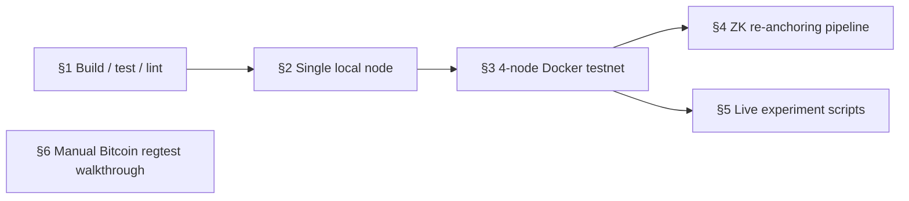
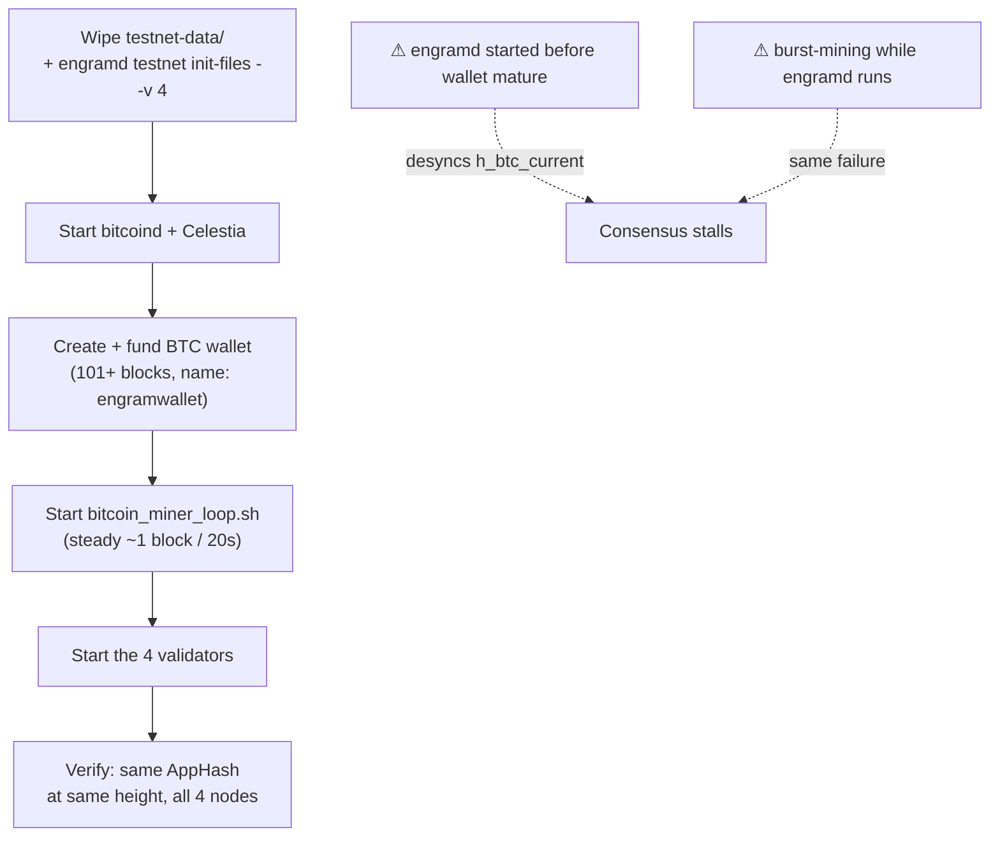
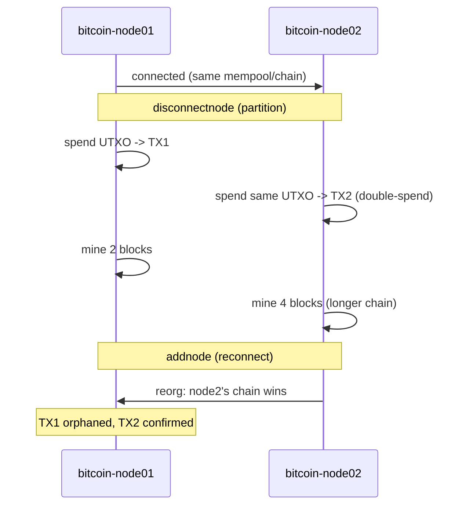

# Development Guide

How to build, test, and run this repo — verified by actually doing it, not aspirational. For
what's architecturally real vs. simplified, see `docs/ARCHITECTURE.md`. For the spec-fidelity
rules that apply to any FSM/consensus code change, see root `CLAUDE.md`.



## 1. Build, test, lint

```bash
make build         # -> build/engramd (host OS/arch)
make build-linux   # -> build/engramd-linux (for Docker images)
make test          # go test -v ./...
make lint          # golangci-lint run (needs golangci-lint v2+, see .golangci.yml)
make proto-gen      # regenerate x/sovereignty/types/*.pb.go (needs buf, protoc-gen-go*)
make zk-compile     # compile the Noir circuit (needs nargo 1.0.0-beta.22 on PATH)
```

Without `make`: `go build ./... && go vet ./... && go test ./...` then `golangci-lint run`. Run
`go vet` before `go test` — it's cheap and CI-enforced, and easy to miss inside a passing test
run's output.

**Pointer bug to avoid**: proto types (`x/sovereignty/types/*.pb.go`) embed a `sync.Mutex`.
Always pass `*PeripheralMetrics`, never the value type — `go vet` catches most but not all
misuses.

### This repo needs a sibling checkout of its CometBFT fork

`go.mod` has `replace github.com/cometbft/cometbft => ../engram-consensus-core` — a local sibling
repo, not a module dependency. Any build/test/lint here needs `../engram-consensus-core` to
exist. CI clones it in a pinned step; see `.claude/skills/github-actions-ci/SKILL.md` rule 6
before touching those workflows (`actions/checkout`'s `path:` cannot check out a sibling repo —
tried, confirmed broken).

If you're changing the fork itself, build/test it directly in `engram-consensus-core` first (its
own module) — this repo's `go build` only consumes the fork's code via `replace`, it doesn't
build the fork.

### Python scripts (`scripts/`)

```bash
# Use python 3.11 or 3.12
python -m venv .venv
source .venv/bin/activate 
pip install -r requirements.txt

black scripts/       # run before committing, not just black --check
flake8 scripts/
```

`black --check` fails on the whole tree, not just files you touched, and CI won't tell you which
ones until it runs. Format the whole tree locally first.

## 2. Running a single local node (no Docker)

```bash
go build -o build/engramd ./cmd/engramd
./build/engramd init my-node
./build/engramd start              # real path: PrepareProposal/ProcessProposal/PreBlocker
./build/engramd start --vanilla    # baseline comparison, skips the ExtendedProposal hooks
```

`start` reads `config.toml` from disk (`loadConfig`, viper-based) — per-node settings (ports,
peers) come from there, not hardcoded defaults. Without `BITCOIN_HOST`/`CELESTIA_BRIDGE_URL` set
(see `.env.example`), BTC/DA sensors fall back to static mocks — fine for a quick smoke test, not
for exercising the real sensor-driven FSM.

## 3. Running the real 4-node Docker testnet

Brings up 4 validators + real `bitcoind` regtest + real Celestia (app + bridge) — the setup
behind every E2–E9 live-data result in `docs/EXPERIMENT.md`. Topology/IPs: see
`docs/ARCHITECTURE.md`.

`make testnet-up`/`make testnet-down` automate the sequence below (correct ordering, idempotent
wallet funding, miner-loop lifecycle, Celestia token fetch). `make byzantine-on
BEHAVIOR=...`/`byzantine-off`, `make double-sign-on`/`double-sign-off`, `make chaos-delay` (or
`-loss`/`-crash`/`-eclipse`/`-btc-delay`), and `make attacker-a1-up`/`attacker-a2-up` (+ their
`-down` counterparts) control the E8/E4 attack-behavior toggles — `make help` lists all of them.
The manual walkthrough below is the reference these targets wrap; use it directly when debugging
a step in isolation.

### Changing `x/sovereignty.Params` (thresholds, hysteresis, peer limits, ...)

`Params` (`x/sovereignty/types/params.go`) is a consensus-critical value — every validator must
compute an identical `expectedState` from the same sensor reading, so it is genesis-configured,
not read from each node's own `.env` at `start` time (a per-process env var could silently
diverge between validators; genesis is generated once and copied identically to all 4 nodes).

Set `ENGRAM_PARAM_<FIELD>` in `.env` before `make testnet-up` (or before `engramd init`/
`testnet init-files` run directly) — see `.env.example` for the full list of 15 fields and their
`DefaultParams()` values. `engramd testnet init-files`/`init` read these, fall back to
`DefaultParams()` per-field when unset, and reject the whole genesis with a clear error
(`Params.Validate`) if the result violates a documented cross-field constraint (e.g.
`SOVEREIGN_THRESHOLD` not exceeding `SUSPICIOUS_THRESHOLD`) — invalid input fails genesis
generation, never a silently-deployed unsafe chain. `start` never reads `ENGRAM_PARAM_*` itself;
it only ever loads whatever landed in `genesis.json`.

**The order below is load-bearing, not a preference.** Starting `engramd` before Bitcoin has a
funded, mature wallet — or mining in bursts while `engramd` is already running — desyncs
`h_btc_current` from `h_btc_anchored` past `vigilante.VerifyReceipt`'s tolerance window and
stalls consensus permanently.



```bash
# 3.1 — fresh genesis (always start clean; see gotcha below for why)
cp .env.example .env    # fill in BITCOIN_RPC_USER/PASSWORD
rm -rf testnet-data/
make build-linux
./build/engramd testnet init-files --v 4

# 3.2 — Bitcoin + Celestia, wallet funded and mature, BEFORE any engramd container
docker compose --env-file .env -f docker/bitcoin-regtest-cluster.yml up -d
docker compose --env-file .env -f docker/celestia-local-cluster.yml up -d

docker exec -it bitcoin-node01 bitcoin-cli -regtest -rpcuser=$BITCOIN_RPC_USER \
  -rpcpassword=$BITCOIN_RPC_PASSWORD createwallet "engramwallet"   # must be this name --
                                                                      # bitcoin_miner_loop.sh
                                                                      # hardcodes it
addr=$(docker exec -it bitcoin-node01 bitcoin-cli -regtest -rpcuser=$BITCOIN_RPC_USER \
  -rpcpassword=$BITCOIN_RPC_PASSWORD -rpcwallet=engramwallet getnewaddress)
docker exec -it bitcoin-node01 bitcoin-cli -regtest -rpcuser=$BITCOIN_RPC_USER \
  -rpcpassword=$BITCOIN_RPC_PASSWORD -rpcwallet=engramwallet generatetoaddress 101 $addr
  # 101: coinbase needs 100 confirmations before it's spendable

./scripts/bitcoin_miner_loop.sh &     # steady cadence from here on, never manual bursts

# 3.3 — the 4 validators
docker compose --env-file .env -f docker/engram-validator-cluster.yml up -d --build
# or: docker compose up -d --build (compose.yml's include: already covers this)
```

Verify: `curl -s http://localhost:26657/status | jq .result.sync_info`, and confirm `AppHash`
matches across all 4 nodes at the same height.

### Gotcha: `priv_validator_state.json` blocks restarts

CometBFT's `FilePV` refuses to sign a vote for a round lower than its last-signed one. Restarting
a container against a leftover `priv_validator_state.json` (no matching fresh WAL) reliably
stalls consensus. Fix: always wipe `testnet-data/` and regenerate genesis (step 3.1) before every
redeploy — this is standing practice, not a one-off workaround.

### Gotcha: `docker compose ... down` with no service names destroys everything

`down` (no service arguments) tears down the **entire compose project**, ignoring any
`--profile` filter used earlier — profiles only scope `up`'s defaults, not `down`. A bare `down`
can destroy a live running cluster mid-experiment. To tear down a profile-gated extra (attacker
swarm, byzantine override, etc.), always name the services explicitly:

```bash
docker compose stop <service names>
docker compose rm -f <service names>
```

Never a bare `down`.

## 4. ZK re-anchoring pipeline (RECOVERING → ANCHORED)

Needs `nargo` + `bb` (Barretenberg) on `PATH`, pinned to `1.0.0-beta.22`.

```bash
./scripts/reanchoring_prover/prove_and_submit.sh    # one-shot: query -> witness -> prove -> submit
./scripts/reanchoring_prover/watch_and_prove.sh      # continuous, used by several live E2/E9 runs
```

Manual steps, if not using the wrapper:

```bash
./build/engramd query-recovery-headers
./build/engramd tx-submit-recovery-proof --proof <file> --public-inputs <file>
```

**Known limitation**: the circuit's `N` (chained headers per proof) is fixed at compile time
(currently 4) — this only works when exactly `N` headers are tracked. Proving takes real time
(tens–hundreds of ms, see E6), so a proof can go stale mid-flight while the interval keeps
growing underneath it. That's the anti-replay check (`RealProofSubmittedHeight`) working
correctly, not a bug — submit while the interval is stable, don't race a growing one.

## 5. Live experiment scripts (`scripts/e2_*` … `scripts/e9_*`)

Each experiment group drives the live testnet through a scenario, polling via
`scripts/framework/logger.py` and injecting faults via `scripts/framework/injector.py`, writing
real CSV/summary output to its own `results_live/`. `docs/EXPERIMENT.md` is the index of what
each experiment measures and which numbers are real live-Docker data vs. in-process
(`tests/e2e/`) data — check its per-section "Measured" notes.

Profile-gated extras, never started by a plain `docker compose up`:

| File | Used for |
|---|---|
| `chaos-delay`/`-loss`/`-crash`/`-eclipse`/`-btc-delay` (in `compose.yml`) | Pumba fault injection |
| `docker/attacker-peer-swarm.yml` | E4/E8's A1 (slot exhaustion) / A2 (Sybil) attacker containers |
| `docker/engram-node04-byzantine.yml` | E8's A3/A4/A6/A7 — swaps node04 for a byzantine build |
| `docker/engram-node04-double-sign.yml` | E8's Double-signing test — a 2nd process on node04's key |

## 6. Manual Bitcoin regtest walkthrough (fork / reorg / double-spend)

Lower-level, not tied to `engramd` at all — useful for debugging `x/vigilante`'s SPV logic in
isolation. Assumes `docker/bitcoin-regtest-cluster.yml` is up (§3.2), or run standalone from
`docker/`. Uses its own `sharedwallet`, separate from §3's `engramwallet` — stop
`bitcoin_miner_loop.sh` first if running this against a live cluster, or its steady mining will
interfere with the controlled fork below.



```bash
export BITCOIN_RPC_USER=...
export BITCOIN_RPC_PASSWORD=...

alias btc1="docker exec -it bitcoin-node01 bitcoin-cli -regtest -rpcuser=$BITCOIN_RPC_USER -rpcpassword=$BITCOIN_RPC_PASSWORD -rpcwallet=sharedwallet"
alias btc2="docker exec -it bitcoin-node02 bitcoin-cli -regtest -rpcuser=$BITCOIN_RPC_USER -rpcpassword=$BITCOIN_RPC_PASSWORD -rpcwallet=sharedwallet"

# clean wallet
btc1 -named unloadwallet wallet_name="sharedwallet" 2>/dev/null
btc2 -named unloadwallet wallet_name="sharedwallet" 2>/dev/null
btc1 loadwallet "sharedwallet" 2>/dev/null || btc1 createwallet "sharedwallet"
btc2 loadwallet "sharedwallet" 2>/dev/null || btc2 createwallet "sharedwallet"

# mine + share key
addr=$(btc1 getnewaddress)
btc1 generatetoaddress 101 $addr
privkey=$(btc1 dumpprivkey $addr)
btc2 importprivkey $privkey
btc2 rescanblockchain

# get UTXO
utxo=$(btc1 listunspent | jq '.[0]')
txid=$(echo $utxo | jq -r '.txid')
vout=$(echo $utxo | jq -r '.vout')
addr1=$(btc1 getnewaddress)
addr2=$(btc2 getnewaddress)

# partition (172.21.0.10/.11 = bitcoin-node01/02 on bitcoin-net)
btc1 disconnectnode 172.21.0.11 2>/dev/null
btc2 disconnectnode 172.21.0.10 2>/dev/null

# TX1 on node1
raw1=$(btc1 createrawtransaction "[{\"txid\":\"$txid\",\"vout\":$vout}]" "{\"$addr1\":1}")
funded1=$(btc1 fundrawtransaction $raw1 | jq -r .hex)
signed1=$(btc1 signrawtransactionwithwallet $funded1 | jq -r .hex)
tx1=$(btc1 sendrawtransaction $signed1)

# TX2 on node2 (double-spend)
raw2=$(btc2 createrawtransaction "[{\"txid\":\"$txid\",\"vout\":$vout}]" "{\"$addr2\":1}")
funded2=$(btc2 fundrawtransaction $raw2 | jq -r .hex)
signed2=$(btc2 signrawtransactionwithwallet $funded2 | jq -r .hex)
tx2=$(btc2 sendrawtransaction $signed2)

# mine competing forks
btc1 generatetoaddress 2 $(btc1 getnewaddress)
btc2 generatetoaddress 4 $(btc2 getnewaddress)

# reconnect -> reorg
btc1 addnode 172.21.0.11 onetry
btc2 addnode 172.21.0.10 onetry
sleep 3

echo "Node1 height:" $(btc1 getblockcount)
echo "Node2 height:" $(btc2 getblockcount)
echo "Check TX1:"; btc1 gettransaction $tx1 2>/dev/null || echo "TX1 ORPHANED"
echo "Check TX2:"; btc1 gettransaction $tx2 2>/dev/null || echo "TX2 NOT FOUND"
echo "Mempool:"; btc1 getrawmempool
```
