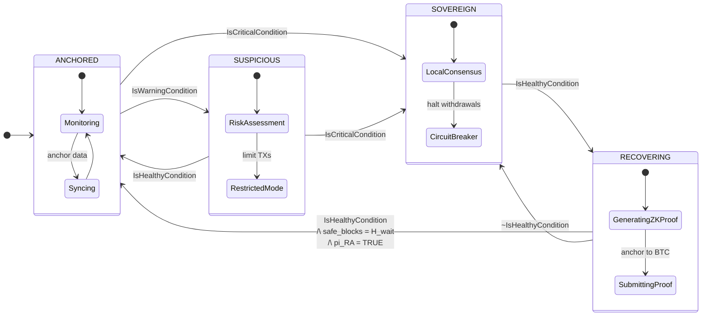
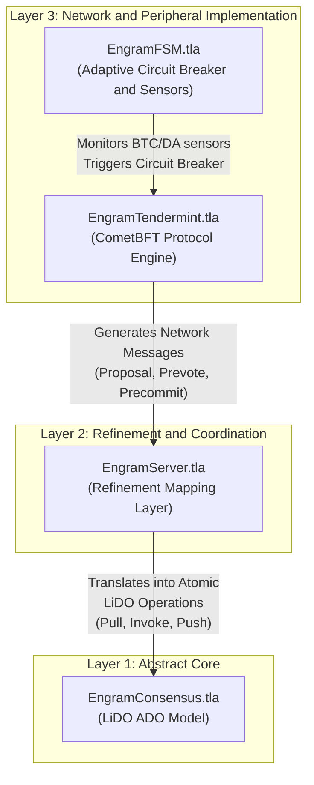
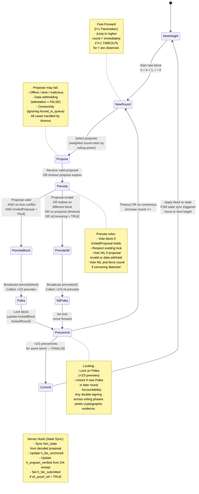
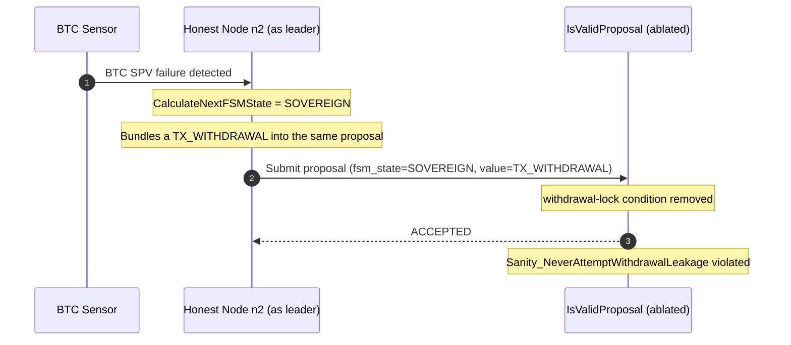
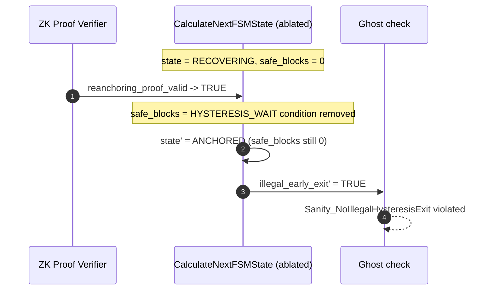
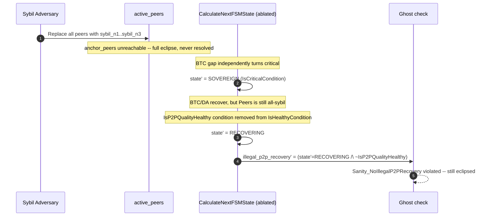
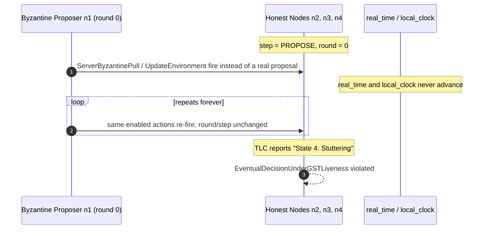
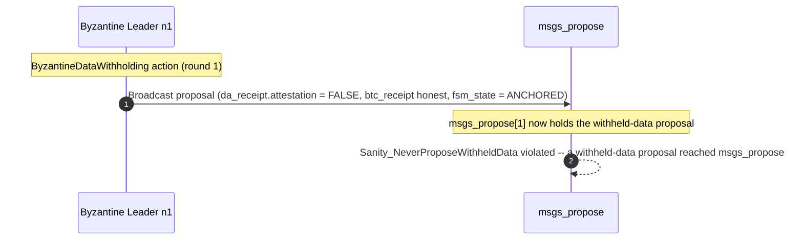
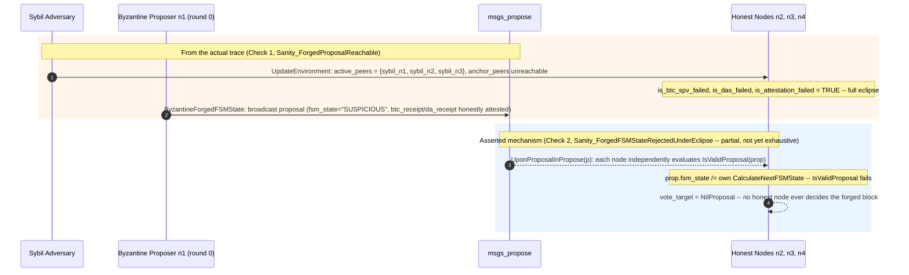

# Formal Specification and Verification of the Engram Hybrid Adaptive Consensus: FSM with Sovereign Fallback

## Table of contents
  - [Abstract](#abstract)
  - [1. Problem Statement](#1-problem-statement)
    - [1.1 Structural Liveness Risk in Modular Blockchains](#11-structural-liveness-risk-in-modular-blockchains)
    - [1.2 The Missing Dimension: Peripheral Network Health in Consensus](#12-the-missing-dimension-peripheral-network-health-in-consensus)
  - [2. Proposed Solution: Hybrid Adaptive Consensus with Sovereign Fallback](#2-proposed-solution-hybrid-adaptive-consensus-with-sovereign-fallback)
    - [2.1 Core Idea](#21-core-idea)
    - [2.2 Finite State Machine](#22-finite-state-machine)
      - [FSM States](#fsm-states)
      - [State Comparison Summary](#state-comparison-summary)
      - [State Machine Diagram](#state-machine-diagram)
    - [2.3 Key Design Properties](#23-key-design-properties)
  - [3. Methodology: Formal Verification via Refinement Mapping](#3-methodology-formal-verification-via-refinement-mapping)
    - [3.1 The Gap in Existing Verification Frameworks](#31-the-gap-in-existing-verification-frameworks)
    - [3.2 The LiDO Framework: Reducing Liveness to Safety](#32-the-lido-framework-reducing-liveness-to-safety)
      - [Mechanized Verification via Refinement Mapping](#mechanized-verification-via-refinement-mapping)
    - [3.3 Layered Specification Architecture](#33-layered-specification-architecture)
  - [4. Network Sensors: Measuring Peripheral Layer Health](#4-network-sensors-measuring-peripheral-layer-health)
    - [4.1 Bitcoin Finality Gap Sensor](#41-bitcoin-finality-gap-sensor)
      - [Bitcoin SPV Verification](#bitcoin-spv-verification)
    - [4.2 Data Availability Gap Sensor](#42-data-availability-gap-sensor)
      - [Data Availability Sampling (DAS)](#data-availability-sampling-das)
    - [4.3 P2P Health Sensor (Tri-Interface Profiler)](#43-p2p-health-sensor-tri-interface-profiler)
  - [5. State Transition](#5-state-transition)
    - [5.1 State Transition Conditions](#51-state-transition-conditions)
      - [Warning Condition](#warning-condition)
      - [Critical Condition](#critical-condition)
      - [Healthy Condition](#healthy-condition)
    - [5.2 State Transition Logic](#52-state-transition-logic)
      - [Transition Definitions](#transition-definitions)
      - [Re-anchoring via ZK-Proof of Recovery](#re-anchoring-via-zk-proof-of-recovery)
      - [Hysteresis Mechanism](#hysteresis-mechanism)
  - [6. Consensus Protocol: Hybrid Adaptive Tendermint with Extended Proposal](#6-consensus-protocol-hybrid-adaptive-tendermint-with-extended-proposal)
    - [6.1 Extended Proposal Structure](#61-extended-proposal-structure)
    - [6.2 Proposal Validation](#62-proposal-validation)
    - [6.3 Consensus State Machine Diagram](#63-consensus-state-machine-diagram)
  - [7. Security and Safety Analysis](#7-security-and-safety-analysis)
    - [7.1 State Invariants](#71-state-invariants)
    - [7.2 Attack Resilience Lemmas](#72-attack-resilience-lemmas)
    - [7.3 Threat Model Boundary: Bitcoin Reorg Depth](#73-threat-model-boundary-bitcoin-reorg-depth)
    - [7.4 Threat Model Boundary: Sensor View Homogeneity](#74-threat-model-boundary-sensor-view-homogeneity)
  - [8. Liveness Analysis and Autonomous Recovery](#8-liveness-analysis-and-autonomous-recovery)
    - [8.1 FSM Temporal Properties](#81-fsm-temporal-properties)
    - [8.2 Transaction-Level Liveness](#82-transaction-level-liveness)
  - [9. Formal Verification stress & ablation](#9-formal-verification-stress--ablation)
    - [9.1 Proof Strategy](#91-proof-strategy)
    - [9.2 Formal Verification Stress Test](#92-formal-verification-stress-test)
      - [9.2.1. Per-Layer Verification Results (non-refinement)](#921-per-layer-verification-results-non-refinement)
    - [9.3 Ablation study & counterexample traces analysis](#93-ablation-study--counterexample-traces-analysis)
  - [References](#references)
  - [Future Work](#future-work)
  - [How to Run the Verification](#how-to-run-the-verification)

## Abstract

This document presents the formal specification and model-checked verification of the **Hybrid Adaptive Consensus** protocol for the Engram modular blockchain. The core research question is: **Can a blockchain that depends on external settlement (Bitcoin) and data availability (Celestia) layers maintain provable Safety and Liveness even when those layers fail?**

We answer affirmatively. The protocol introduces a Finite State Machine (FSM) that autonomously degrades security level — rather than halting — when external dependencies become unavailable. **Critically, the consensus mechanism is extended beyond classical transaction ordering: validators now reach Byzantine-fault-tolerant agreement on both the application state and the health status of the peripheral network layers, treating the FSM state as a first-class consensus variable.**

## 1. Problem Statement

### 1.1 Structural Liveness Risk in Modular Blockchains

Modular blockchain architectures achieve scalability by separating the functions of a monolithic chain into independent, specialized layers. In the Engram architecture these layers are:

- **Execution Layer**: The Engram App-Chain, running CometBFT consensus with sub-two-second block times.
- **Data Availability (DA) Layer**: Celestia, ensuring transaction data is published and retrievable before state transitions are accepted.
- **Settlement Layer**: Bitcoin, accessed via Babylon, providing thermodynamic finality through Proof-of-Work checkpointing.

This separation introduces a dependency graph: the Execution Layer requires the DA Layer to confirm data availability before finalizing blocks, and requires the Settlement Layer to anchor checkpoints for long-range attack resistance. If either dependency becomes degraded or unreachable, a naive implementation has no recourse and halts entirely.

Concrete failure scenarios include:

- Bitcoin network congestion causes checkpoint finality to fall hours behind, triggering a liveness violation in the fork-choice rule.
- A Celestia network partition causes Data Availability Sampling (DAS) to fail, making the DA receipt unavailable.
- Simultaneous loss of both the Settlement and DA layers.

In all of these scenarios, an unmodified CometBFT engine would deadlock indefinitely because its block validity rule depends on an external precondition that is no longer satisfiable.

### 1.2 The Missing Dimension: Peripheral Network Health in Consensus

**Standard Byzantine Fault-Tolerant (BFT) consensus** protocols are concerned exclusively with **agreement on transaction ordering**. A valid block is one that contains well-formed transactions signed by a correct proposer at the right round. There is no native mechanism to represent or agree upon the operational health of the infrastructure that the chain depends upon.

This creates a second gap: **even if nodes could individually detect that the Bitcoin finality gap has grown past a threshold, they would not reach a consistent, forkless view of what the system should do about it. Different nodes observing slightly different sensor readings could make different decisions, breaking consensus.**

The **Engram Hybrid Adaptive Consensus** addresses both gaps simultaneously. Each consensus proposal carries the current FSM state, a DA receipt, and a Bitcoin anchor height as first-class fields. Validators only accept proposals whose embedded FSM state is consistent with their local sensor readings. The result is **Byzantine-fault-tolerant agreement on peripheral network health**, not only on transactions.


## 2. Proposed Solution: Hybrid Adaptive Consensus with Sovereign Fallback

### 2.1 Core Idea

The protocol maintains a four-state FSM that degrades gracefully across security levels. Instead of halting when external dependencies fail, the network:

1. **Detects degradation** through deterministic local network sensors (e.g., integrated Bitcoin SPV, Celestia DAS).
2. **Proposes a local view** of the peripheral environment, embedding the leader's observed FSM state, DA receipt, and Bitcoin anchor height directly into the current block proposal.
3. **Reaches a 2/3-quorum agreement** on this external state telemetry atomically alongside the transaction payload.
4. **Applies the appropriate security policy** (circuit breaker, withdrawal lock, fork-choice rule) based on the globally agreed-upon state.
5. **Recovers autonomously** when peripheral layers are restored, re-anchoring sovereign blocks to Bitcoin via a single recursive ZK-Proof.

Critically, the consensus object is extended: a valid proposal is no longer merely a transaction batch; it is a tuple `[transactions, fsm_state, da_receipt, btc_receipt, zk_proof_ref]`. A validator will only issue a `Prevote` for a proposal if all peripheral components strictly match its own local sensor readings, effectively establishing Byzantine-fault-tolerant agreement on the health of the entire modular stack.

### 2.2 Finite State Machine

#### FSM States

The FSM governs four states:
 
- **ANCHORED**: Normal operation. Bitcoin-secured via Babylon checkpointing; DA confirmed via Celestia (see SS4.2 for the gap between this target design and the current prototype's implementation).
- **SUSPICIOUS**: Early warning. Warning conditions detected — the reference implementation
  throttles a subset of transaction admission here as a prototype-level policy, not modeled in
  this specification.
- **SOVEREIGN**: Active partition. Local PoS activated; Circuit Breaker halts all cross-chain withdrawals.
- **RECOVERING**: Resolution. Connectivity restored; aggregates all Sovereign transitions into a single recursive ZK-Proof to re-anchor to Bitcoin.

#### State Comparison Summary

| State | Incident Phase | Security Basis | Withdrawals | Throughput | Finality |
|---|---|---|---|---|---|
| ANCHORED | Normal | Bitcoin + Celestia DA | Permitted | Full | ~10-60 min |
| SUSPICIOUS | Early warning | Bitcoin (degraded) | Permitted | Restricted | Moderate |
| SOVEREIGN | Active partition | Local PoS | Locked | Full | ~2 sec |
| RECOVERING | Resolution | Local PoS + pending proof | Locked | Full | ~2 sec |

#### State Machine Diagram



### 2.3 Key Design Properties

- **Graceful degradation.** Security level decreases monotonically under failure rather than the system halting. Data already written to the chain remains protected.

- **Self-aware consensus.** The FSM transition is not an out-of-band governance action; it is agreed upon within the standard Tendermint consensus pipeline. The FSM state is embedded in each proposal and validated by every prevoting node.

- **Hysteresis.** Recovery from `SOVEREIGN` back to `ANCHORED` requires a sustained healthy period of `HYSTERESIS_WAIT` consecutive blocks and a valid ZK-Proof. This prevents state oscillation ("flapping") caused by intermittent connectivity.

- **ZK-based re-anchoring.** Blocks produced in SOVEREIGN mode are secured by local PoS. When connectivity is restored, a single recursive SNARK aggregates all sovereign transitions into one proof, allowing O(1) verification. No re-execution of sovereign blocks is required.

- **Economic circuit breaker.** Cross-chain withdrawals are locked when the state is `SOVEREIGN` or `RECOVERING`, preventing fund extraction during periods when Bitcoin finality is not available to protect against reversion.


## 3. Methodology: Formal Verification via Refinement Mapping

### 3.1 The Gap in Existing Verification Frameworks

Historically, formally verifying the Liveness of Byzantine Fault-Tolerant (BFT) consensus protocols under partial synchrony has been a formidable challenge. While traditional model checkers excel at proving Safety, they fundamentally struggle with Liveness properties that require reasoning over infinite, continuous time traces. Consequently, most liveness proofs rely on informal, unmechanized arguments based on the Global Stabilization Time (GST).

This superficial approach is inadequate for the stringent security requirements of the Engram architecture. We must address three core challenges:

- **Full Lifecycle Liveness:** Engram's consensus must transition through complex Finite State Machine (FSM) states (e.g., `SOVEREIGN` to `ANCHORED`). We require mathematical guarantees that the system will never deadlock while awaiting strict preconditions (network health, ZK-Proof validity).

- **Hybrid Deadlock Freedom:** Engram runs two interacting state machines concurrently (the Tendermint consensus core and the Sovereign Fallback FSM). Verifying their integration requires a robust, compositional refinement technique.

- **Temporal Model Checking:** Standard invariant-based tools cannot automatically resolve infinite temporal properties without an abstraction that translates continuous time into finite, verifiable segments

### 3.2 The LiDO Framework: Reducing Liveness to Safety

To bridge this methodological gap, this project adopts the LiDO (Linearizable Byzantine Distributed Objects) framework ([Lefort et al., PODC 2024](https://dl.acm.org/doi/epdf/10.1145/3656423)) as the mathematical baseline. LiDO overcomes the liveness bottleneck through a paradigm shift: **reducing Liveness to Safety via Segmented Traces.** 

Instead of modeling infinite continuous time, LiDO discretizes time into finite segments of length $\Delta$ (the maximum network delay). Under partial synchrony, this guarantees that messages sent by a correct node in segment $\tau_i$ are definitively delivered by segment $\tau_{i+1}$. This mathematical trick constrains infinite temporal properties into discrete, verifiable step-by-step safety checks.

At its core, LiDO defines consensus via an Abstract Pacemaker (`round`, `rem_time`) and three atomic operations

- **Pull**: A leader election establishing an **Election Quorum Certificate** (`E_QC`). 
- **Invoke**: Proposing a method (transaction batch), establishing a **Method Quorum Certificate** (`M_QC`). 
- **Push**: Committing the method, advancing logical clocks, and establishing a **Commit Quorum Certificate** (`C_QC`).

#### Mechanized Verification via Refinement Mapping

A refinement mapping mathematically proves that a complex concrete system correctly implements a simpler abstract specification. If the abstract model guarantees a property $P$, the concrete implementation automatically inherits $P$.

In our architecture, `EngramServer.tla` serves as the shared-memory refinement bridge. It intercepts raw Tendermint consensus events and continuously constructs the abstract LiDO certificate tree. Through our refinement variables (`MappedTree`, `mapped_fsm_state`, `mapped_local_times`), the TLC model checker directly verifies `AbstractConsensus!Safety` and `AbstractConsensus!Liveness`, allowing Engram to mechanically inherit LiDO's rigorous theorems for the entire hybrid protocol.


### 3.3 Layered Specification Architecture

The specification is organized into four layers following the refinement hierarchy:



- **Layer 1 — The Abstract Core (`EngramConsensus.tla`):** The mathematical LiDO specification. It defines the abstract buffer tree of quorum certificates (ADO-B), the fork-choice rule (`CanElect`), the K-Deep finality rule for `ANCHORED` mode, and the maximum-stake-branch rule for `SOVEREIGN` mode. Safety and Liveness are established at this highly abstract level.

- **Layer 2 — The Refinement Bridge (`EngramServer.tla`):** The shared-memory integration layer. It utilizes four server hooks to intercept concrete Tendermint network events and atomically translate them into abstract LiDO operations:
  - `ServerInsertProposal` $\rightarrow$ **Pull** (`E_QC` creation)
  - `ServerProposerVotes` $\rightarrow$ **Invoke** (`M_QC` creation)
  - `ServerUponProposalInPrecommitNoDecision` $\rightarrow$ **Push** (`C_QC` creation & FSM state sync)
  - `ServerUponTimeoutCert` $\rightarrow$ **Timeout** (`T_QC` creation)

- **Layer 3 — The Concrete Implementations:**
  - **`EngramTendermint.tla` (Protocol Engine)**: The customized CometBFT consensus engine managing the full Propose $\rightarrow$ Prevote $\rightarrow$ Precommit $\rightarrow$ Commit pipeline. It processes the extended proposal structure, simulates Byzantine attacks (data withholding, censorship, timeout flooding), and implements the improved $f+1$ pacemaker (UponfPlusOneTimeoutsAny).
  - **`EngramFSM.tla` (Sovereign Fallback):** The adaptive circuit breaker. It continuously computes `IsWarningCondition`, `IsCriticalCondition`, and `IsHealthyCondition` from peripheral sensor readings. It also manages the hysteresis counter (`safe_blocks`) and ZK-Proof validity flag (`reanchoring_proof_valid`).


## 4. Network Sensors: Measuring Peripheral Layer Health

The FSM requires deterministic, on-chain measurements of peripheral layer health. Three sensor categories are continuously evaluated. Sensor values are embedded in each consensus proposal and agreed upon by quorum, ensuring all correct nodes operate on a consistent view of network health.

### 4.1 Bitcoin Finality Gap Sensor

This sensor measures how far the latest Engram epoch checkpoint is from being Bitcoin-confirmed. A growing gap indicates Bitcoin congestion, or a liveness attack on the checkpointing system. Referring to the [Vigilante Checkpointing Monitor](https://docs.babylonlabs.io/guides/overview/babylon_genesis/architecture/vigilantes/monitor/), the Finality Gap Sensor formula is simplified as follows:

$$\Delta H_{\text{BTC}} = H_{\text{current}} - \min(H_{\text{submitted}},\, H_{\text{anchored}})$$

- $H_{\text{current}}$: latest Bitcoin block height observed by Engram validator nodes running an SPV light client.
- $H_{\text{submitted}}$: Bitcoin block height at the moment an Engram epoch checkpoint was broadcast.
- $H_{\text{anchored}}$: Bitcoin block height at which the checkpoint was confirmed (included in the Bitcoin chain).

The formula uses $\min(H_{\text{submitted}}, H_{\text{anchored}})$ as the baseline so that a submitted-but-unconfirmed checkpoint is counted toward the gap.

#### Bitcoin SPV Verification

The gap formula measures *delay*, but cannot detect *forged* checkpoint data. An eclipsed node receiving a fabricated `btc_receipt` from a Byzantine leader would see a plausible height value while the underlying checkpoint is invalid. To close this gap, each validator performs two off-band checks independently of the consensus pipeline, using Babylon's BTC Light Client and BTC Checkpoint modules:

1. **OP_RETURN Inclusion Check**: verify via Merkle proof that the Engram checkpoint transaction is included in the claimed Bitcoin block.
2. **Block Header Verification**: hash the block header to confirm `checkpoint_block_hash` matches the canonical chain maintained by the local SPV client.

The combined result is stored as a single boolean `is_btc_spv_failed` in local state, and enters `IsCriticalCondition` directly — a failed SPV check means the current anchor height itself is unverifiable, not merely stale, the same severity class as `IsBTCGapSovereign`, unlike `is_das_failed`/`is_attestation_failed` which only feed the softer `IsWarningCondition`. An earlier revision instead relied on the failure indirectly widening `btc_gap` past `SOVEREIGN_THRESHOLD` on its own; that left a multi-block exploitation window where a forged or since-reorged anchor stayed trusted (withdrawals unlocked) until the gap organically grew, since nothing read the flag directly.

### 4.2 Data Availability Gap Sensor

This sensor measures the lag between the current Engram chain head and the last block for which a verified DA commitment receipt has been received from Celestia.

$$\Delta H_{\text{DA}} = H_{\text{local}} - H_{\text{verified}}$$

- $H_{\text{local}}$: current Engram-app chain block height.
- $H_{\text{verified}}$: highest Engram-app chain block height for which a valid DA commitment attestation has been received.

#### Data Availability Sampling (DAS) — target design vs. implemented

**Target design.** Each Engram validator node, acting as a Celestia light client, performs $N = 16$ random sampling checks per block. This is sufficient to confirm data availability with probability greater than 99%.

Let $s_i \in \{\text{TRUE}, \text{FALSE}\}$ denote the outcome of the $i$-th sample:

$$\text{IsAvailable}(B) \triangleq \bigwedge_{i=1}^{N} s_i \qquad \text{Failed}(B) \triangleq \exists\, i \in \{1, \dots, N\} \text{s.t.} \neg s_i$$

The boolean `is_das_failed` is set to TRUE if any sampling check fails within the current epoch. Real Blobstream attestation (an EVM-side, Merkle-verifiable relay of Celestia's data root) backs `is_attestation_failed`, independent of the sampling result.

**Implemented (current prototype), not the above.** `x/da/rpc.go`'s `Available` calls `blob.GetAll` once against this validator's own `celestia-bridge` instance -- a single retrieval check, not $N=16$ probabilistic samples, and no Blobstream integration. `is_das_failed` and `is_attestation_failed` both derive from this one `Failed()`/`ProbeHealthy` signal. `EngramFSM.tla` treats both as free booleans (`is_das_failed \in BOOLEAN`), so this simplification doesn't affect spec fidelity -- the gap is between this README's target design and the prototype, not between the formal model and the prototype.

### 4.3 P2P Health Sensor (Tri-Interface Profiler)

The Bitcoin and DA sensors each reduce to one numeric gap. P2P health can't: a raw peer count can't tell an honest long-lived peer from a freshly injected Sybil, and Eclipse attacks — surveyed in Rehman et al. (2025) [[8]](#references) — combine node-discovery poisoning, peer-eviction gaming, and network-level routing control to stay hidden from any single metric.

`IsP2PQualityHealthy` covers this with six constants in two groups, applied uniformly to all three protected interfaces (Engram P2P, Bitcoin SPV client, Celestia light client):

```tlaplus
IsP2PQualityHealthy ==
    \* Group 1 — Structural (topology-based attacks)
    /\ SubnetDiversity            >= MIN_SUBNET_DIVERSITY  \* no ASN-level monopoly
    /\ Cardinality(ActiveAnchors) >= MIN_ANCHOR_PEERS      \* anchor nodes reachable
    /\ Cardinality(CleanPeers)    >= MIN_PEERS             \* sufficient honest peers

    \* Group 2 — Behavioral & Temporal (identity-rotation and relay attacks)
    /\ peer_churn_rate            <= MAX_CHURN_RATE        \* no Dynamic Replacement attack
    /\ avg_peer_tenure            >= MIN_AVG_TENURE        \* no fresh Sybil injection
    /\ peer_latency               <= MAX_PEER_LATENCY      \* no relay node interception
```

`P2PAdversaryAttack` (`EngramFSM.tla`) models a weakest-link adversary: compromising any one of the three interfaces trips all six metrics at once.

| Constant | Group | Attack Defeated |
|---|---|---|
| `MIN_PEERS` | Structural | Peer slot exhaustion, basic Sybil |
| `MIN_SUBNET_DIVERSITY` | Structural | ASN-level BGP hijacking, botnet monopoly |
| `MIN_ANCHOR_PEERS` | Structural | Complete anchor isolation (triggers Critical) |
| `MAX_CHURN_RATE` | Behavioral | Dynamic Replacement, IP rotation |
| `MIN_AVG_TENURE` | Behavioral | Fresh Sybil injection detection |
| `MAX_PEER_LATENCY` | Temporal | Relay node interception, BGP detour |

**Scope limit:** these six constants are static aggregates, not identity checks. A patient adversary can manipulate them -- e.g. exploiting the eviction policy to keep Sybil peers artificially "long-lived" (Rehman et al. §III.1) -- and satisfy all six while still controlling the peer set. Defeating that needs cryptographic peer authentication (their §V.B.1), out of scope for this FSM-level abstraction.


## 5. State Transition 

### 5.1 State Transition Conditions

Sensors only **propose** a target state; the actual FSM state is determined by the consensus pipeline. `CalculateNextFSMState` is a pure function mapping sensor readings to a target state, and `ExecuteFSMTransition` writes the agreed state after block commit (triggered by `ServerUponProposalInPrecommitNoDecision`). A validator prevotes for a proposal only if the embedded `fsm_state` matches `CalculateNextFSMState` at its own local sensor readings.

#### Warning Condition

```tlaplus
IsWarningCondition == 
    \/ IsBTCGapSuspicious   \* T_Suspicious <= btc_gap < T_Sovereign
    \/ ~IsDAHealthy         \* da_gap >= DA_THRESHOLD \/ is_das_failed
    \/ ~IsP2PQualityHealthy \* any of the 6 structural/behavioral bounds violated
```

#### Critical Condition

```tlaplus
IsCriticalCondition == 
    \/ IsBTCGapSovereign                            \* btc_gap >= T_Sovereign
    \/ is_btc_spv_failed                            \* BTC SPV/header verification failed -- untrustworthy, not merely stale
    \/ Cardinality(ActiveAnchors) = 0               \* complete anchor isolation
    \/ suspicious_duration >= MAX_SUSPICIOUS_TIME   \* escalation timeout
```

The anchor isolation clause captures total Eclipse Attack success and escalates directly to SOVEREIGN without waiting for the BTC gap threshold. The `suspicious_duration` timeout prevents the system from remaining indefinitely in SUSPICIOUS.

#### Healthy Condition

```tlaplus
IsHealthyCondition == 
    /\ ~IsBTCGapSovereign
    /\ ~IsBTCGapSuspicious
    /\ ~is_btc_spv_failed
    /\ IsDAHealthy
    /\ IsP2PQualityHealthy
```

`IsP2PQualityHealthy` (Section 4.3) prevents an eclipsed node from declaring the network healthy and unilaterally triggering recovery.

### 5.2 State Transition Logic

All transitions require greater than 2/3 quorum agreement through the consensus pipeline. In the current specification, the FSM transition is driven by a **pure function** `CalculateNextFSMState` that maps current sensor readings to a target state deterministically, and an **action** `ExecuteFSMTransition` that writes the new state and updates the hysteresis counter upon block commit.

#### Transition Definitions

Unlike an earlier draft of this section, the transition logic is not a set of
separate named operators — it is a single pure function, `CalculateNextFSMState`
(`EngramFSM.tla`), implemented as one `CASE` expression. This is deliberate:
keeping every transition guard in one place is what lets `StrictFSMTransitionSafety`
mechanically confirm that no case admits an illegal direct jump between
non-adjacent states.

```tlaplus
CalculateNextFSMState ==
    CASE state = "ANCHORED"   /\ IsCriticalCondition -> "SOVEREIGN"
      [] state = "ANCHORED"   /\ IsWarningCondition /\ ~IsCriticalCondition
                               /\ unhealthy_streak + 1 >= DOWN_HYSTERESIS_THRESHOLD -> "SUSPICIOUS"
      [] state = "ANCHORED"   /\ IsWarningCondition /\ ~IsCriticalCondition -> "ANCHORED"

      [] state = "SUSPICIOUS" /\ IsCriticalCondition -> "SOVEREIGN"
      [] state = "SUSPICIOUS" /\ suspicious_duration >= MAX_SUSPICIOUS_TIME -> "SOVEREIGN"
      [] state = "SUSPICIOUS" /\ IsHealthyCondition
                               /\ suspicious_safe_blocks + 1 >= SUSPICIOUS_HYSTERESIS_WAIT -> "ANCHORED"
      [] state = "SUSPICIOUS" /\ IsHealthyCondition -> "SUSPICIOUS"

      [] state = "SOVEREIGN"  /\ IsHealthyCondition  -> "RECOVERING"

      [] state = "RECOVERING" /\ IsCriticalCondition -> "SOVEREIGN"
      [] state = "RECOVERING" /\ ~IsHealthyCondition
                               /\ unhealthy_streak + 1 >= EffectiveDownHysteresisThreshold -> "SOVEREIGN"
      [] state = "RECOVERING" /\ ~IsHealthyCondition -> "RECOVERING"
      [] state = "RECOVERING" /\ IsHealthyCondition  /\ safe_blocks = HYSTERESIS_WAIT /\ reanchoring_proof_valid = TRUE -> "ANCHORED"
      [] state = "RECOVERING" /\ IsHealthyCondition  -> "RECOVERING"

      [] OTHER -> state
```

Read state-by-state:

* **From ANCHORED:** `IsCriticalCondition` drops straight to `SOVEREIGN`; `IsWarningCondition` alone only demotes to `SUSPICIOUS` after `unhealthy_streak+1 >= DOWN_HYSTERESIS_THRESHOLD` consecutive blocks (absorbs single-block noise) — never jumps directly to/from `RECOVERING`.
* **From SUSPICIOUS:** escalates to `SOVEREIGN` on `IsCriticalCondition` or once `suspicious_duration >= MAX_SUSPICIOUS_TIME` (gray-failure timeout). Recovers to `ANCHORED` only after `suspicious_safe_blocks+1 >= SUSPICIOUS_HYSTERESIS_WAIT` consecutive healthy blocks (closes the one-block reset arbitrage).
* **From SOVEREIGN:** moves to `RECOVERING` once `IsHealthyCondition` holds; `ExecuteFSMTransition` (below) then governs how long it must stay healthy before exiting.
* **From RECOVERING:** `IsCriticalCondition` falls straight back to `SOVEREIGN`; a non-critical failure is absorbed like ANCHORED's but against `EffectiveDownHysteresisThreshold` (doubles per failed attempt, capped at `MAX_DOWN_HYSTERESIS_THRESHOLD`). Exit to `ANCHORED` needs `IsHealthyCondition`, `safe_blocks = HYSTERESIS_WAIT`, and `reanchoring_proof_valid = TRUE` together (§5.2 "Re-anchoring via ZK-Proof of Recovery" below).

`suspicious_duration` is incremented while the FSM remains in `SUSPICIOUS` and reset to zero on any other transition (see `ExecuteFSMTransition` below) — it feeds the timeout escalation above, not `IsCriticalCondition` directly.

#### Re-anchoring via ZK-Proof of Recovery

See [`circuit/README.md`'s "Formal Definition: Proof of Recovery"](../circuit/README.md#formal-definition-proof-of-recovery).

#### Hysteresis Mechanism

Three counters guard the three edges against single-block noise, each requiring N consecutive blocks rather than reacting to one:

- **`safe_blocks`** (RECOVERING → ANCHORED): needs `HYSTERESIS_WAIT` consecutive healthy blocks; a critical failure hard-resets it to 0, a non-critical one only leaks it down by one.
- **`unhealthy_streak`** (ANCHORED → SUSPICIOUS, RECOVERING → SOVEREIGN): needs `DOWN_HYSTERESIS_THRESHOLD` consecutive non-critical unhealthy blocks (RECOVERING uses the exponentially-backed-off `EffectiveDownHysteresisThreshold` instead); resets on any healthy block.
- **`suspicious_safe_blocks`** (SUSPICIOUS → ANCHORED): needs `SUSPICIOUS_HYSTERESIS_WAIT` consecutive healthy blocks -- closes the one-block gray-failure-timeout arbitrage.


## 6. Consensus Protocol: Hybrid Adaptive Tendermint with Extended Proposal

### 6.1 Extended Proposal Structure

The base consensus engine is CometBFT (Tendermint). The key extension is the **Proposal structure**, which carries additional fields required by the hybrid model:

```text
Proposal := {
    value        : transaction batch (TX_NORMAL | TX_WITHDRAWAL),
    timestamp    : local clock at proposal time,
    round        : current consensus round,
    fsm_state    : target FSM state computed by CalculateNextFSMState,
    da_receipt   : {
                     published_block_height : Nat,   -- last DA-verified Engram-app chain height
                     attestation            : Bool   -- DA confirmation (target design: Blobstream; SS4.2)
                   },
    btc_receipt  : {
                     checkpoint_block_height : Nat,   -- Bitcoin block containing Engram checkpoint 
                     checkpoint_block_hash   : Hash   -- canonical chain hash of the block contains Engram checkpoint
                   },
    zk_proof_ref : Bool  -- refined to the proof's attested root hash (ExtendedProposal.ZKProofRef);
                            only presence is checked, so non-nil/nil still maps to TRUE/FALSE.
    healthy      : Bool  -- IsHealthyCondition at proposal time, committed for unhealthy_streak agreement.
}
```

### 6.2 Proposal Validation

A validator accepts a proposal and casts a `PREVOTE` only if `IsValidProposal(proposal)` holds. This predicate enforces:

- `fsm_state` matches `CalculateNextFSMState` at the validator's own sensor readings.
- `healthy` matches `IsHealthyCondition` -- an independent check, since `fsm_state` alone can't distinguish genuinely healthy from hysteresis-absorbed-warning.
- The DA receipt is valid and within `DATolerance(r)`'s round-adaptive gap, whenever `fsm_state \in {ANCHORED, RECOVERING}` or `IsDAHealthy`.
- `btc_receipt.checkpoint_block_height` is monotonic non-decreasing within `BTCTolerance(r)`, and `VerifySPVProof(btc_receipt)` passes, under the same condition as the DA receipt -- so a proposal degrading away from `ANCHORED`/`RECOVERING` because BTC is down isn't also forced to carry a checkpoint no leader could produce during that outage.
- Withdrawals are blocked when `fsm_state \in {SOVEREIGN, RECOVERING}` (same scope as §7.1's `CircuitBreakerSafety`).
- A ZK-Proof (`VerifyZkProof`) is mandatory when `fsm_state = RECOVERING` and `safe_blocks = HYSTERESIS_WAIT`.

### 6.3 Consensus State Machine Diagram




## 7. Security and Safety Analysis

The formal correctness of the hybrid consensus protocol is guaranteed across the entire reachable state space. The network is modeled against a Byzantine adversary controlling up to $f$ nodes out of $n = 3f + 1$ total, with adversarial message scheduling and non-deterministic peripheral sensor readings.

**Theorem 7.1 (Hybrid Consensus Safety and Accountability).** *Under partial synchrony, no two honest nodes will ever decide on conflicting blocks or conflicting FSM states. Any safety violation mathematically guarantees the existence of cryptographic double-signing evidence.*

### 7.1 State Invariants

**Invariant S1 (Circuit Breaker Isolation).** Cross-chain withdrawals are strictly locked if and only if the protocol operates in a fallback state. This prevents fund extraction during any period when Bitcoin finality cannot guarantee the irreversibility of cross-chain transactions.

```tlaplus
CircuitBreakerSafety ==
    WithdrawLocked <=> (state \in {"SOVEREIGN", "RECOVERING"})
```

Formally specified in `EngramFSM.tla` as `CircuitBreakerSafety` and verified in both model checker configurations.

**Invariant S2 (Hysteresis Integrity).** A transition from `RECOVERING` back to `ANCHORED` is impossible without satisfying the full hysteresis wait period and providing a valid recursive ZK-Proof. This prevents premature re-anchoring during intermittent connectivity.

```tlaplus
HysteresisSafety ==
    [][ (state = "RECOVERING" /\ state' = "ANCHORED")
        => (safe_blocks = HYSTERESIS_WAIT /\ reanchoring_proof_valid) ]_fsmVars
```

Formally specified in `EngramFSM.tla` as `HysteresisSafety` and verified as a temporal safety property in `MC_ServerRefinementSafety`.

**Invariant S2b (Suspicious-Exit Hysteresis Integrity).** The symmetric up-hysteresis guard on the `SUSPICIOUS -> ANCHORED` edge (§5.2): a single healthy block cannot exit `SUSPICIOUS`, closing the gray-failure-timeout arbitrage where an attacker resets `suspicious_duration` for free.

```tlaplus
SuspiciousHysteresisSafety ==
    [][ (state = "SUSPICIOUS" /\ state' = "ANCHORED")
        => (suspicious_safe_blocks = SUSPICIOUS_HYSTERESIS_WAIT - 1) ]_fsmVars
```

Formally specified in `EngramFSM.tla` as `SuspiciousHysteresisSafety` and checked as a `PROPERTIES` entry in `MC_FSMSafety.cfg`.

**Invariant S3 (Strict FSM Transition Safety).** Only legal adjacency transitions are permitted, preventing any illegal or out-of-order state changes.

```tlaplus
StrictFSMTransitionSafety == 
    [][ state /= state' => 
        \/ (state = "ANCHORED"   /\ state' \in {"SUSPICIOUS", "SOVEREIGN"})
        \/ (state = "SUSPICIOUS" /\ state' \in {"ANCHORED", "SOVEREIGN"})
        \/ (state = "SOVEREIGN"  /\ state' = "RECOVERING")
        \/ (state = "RECOVERING" /\ state' \in {"ANCHORED", "SOVEREIGN"})
      ]_fsmVars
```

**Invariant S4 (FSM State Consistency).** Every decided proposal must carry the same FSM state that the network is currently operating in. This closes the gap identified in Section 1.2: no node can commit a block claiming a different security posture than the one the honest majority agreed upon.

```tlaplus
FSMStateConsistency ==
    \A p \in HonestNodes:
        decision[p] /= NilDecision => decision[p].prop.fsm_state = state
```

Formally specified in `EngramServer.tla` as `FSMStateConsistency`, part of `HybridTendermintInvariant`.

**Invariant S5 (Monotonicity Safety).** Chain heights and real time must monotonically increase or remain constant, preventing time-travel or chain rollback anomalies.

```tlaplus
MonotonicitySafety == 
    [][ /\ h_btc_current'    >= h_btc_current
        /\ h_btc_anchored'   >= h_btc_anchored
        /\ h_engram_current' >= h_engram_current
        /\ real_time'        >= real_time 
      ]_serverVars
```

### 7.2 Attack Resilience Lemmas

Beyond the state invariants, the `IsValidProposal` predicate in `EngramTendermint.tla` serves as a semantic firewall enforcing the following attack-specific lemmas at the consensus layer.

**Lemma 7.2 (Data Withholding Resistance).** A Byzantine leader publishing a block header while withholding the transaction body (`attestation = FALSE`) will have its proposal rejected by all honest validators, who cast PREVOTE NIL and force a round change.

```tlaplus
DAReceiptConsistency ==
    \A p \in HonestNodes:
        (decision[p] /= NilDecision /\
        (decision[p].prop.fsm_state \in {"ANCHORED", "RECOVERING"} \/ IsDAHealthy))
        => decision[p].prop.da_receipt.attestation = TRUE
```

The `\/ IsDAHealthy` branch closes a gap the state-only check would otherwise leave: a decided block whose `fsm_state` is `SUSPICIOUS` or `SOVEREIGN` isn't exempted from the attestation requirement just because it's outside `{ANCHORED, RECOVERING}` — if the DA layer is *currently* healthy, the attestation must still be `TRUE` regardless of which state the block claims. The `ByzantineDataWithholding` action in `EngramTendermint.tla` explicitly injects such malformed proposals. `DAReceiptConsistency` in `HybridTendermintInvariant` formally captures the invariant that no such proposal is ever decided.

**Lemma 7.3 (Long-Range Attack Prevention).** The fork-choice rule enforces strict monotonic settlement anchoring via `VerifySPVProof`. Any adversarial proposal attempting to revert to a prior anchor height, or carrying a forged Bitcoin branch hash, is automatically rejected.

```tlaplus
BTCConsistency ==
    \A p \in HonestNodes:
        decision[p] /= NilDecision
        => decision[p].prop.btc_receipt.checkpoint_block_height = h_btc_anchored
```

The `ByzantineDataWithholding` action also injects a forged BTC receipt (`<<"BTC_FORK", height>>`) to verify the SPV hash check rejects it at proposal validation -- scoped, like `DAReceiptConsistency` above, to `fsm_state \in {ANCHORED, RECOVERING} \/ IsBTCHealthy`: a proposal legitimately degrading away from `ANCHORED`/`RECOVERING` *because* BTC is down isn't also required to carry a checkpoint the honest network can independently verify while it's down, mirroring the `\/ IsDAHealthy` carve-out's own reasoning. Outside that condition -- i.e. whenever the decided state is `ANCHORED`/`RECOVERING`, or BTC is currently healthy regardless of state -- the SPV check still applies unconditionally.

**Lemma 7.4 (Byzantine Message Flooding Mitigation).** The accepted message set from the Byzantine coalition per round and message type is deterministically bounded by $|F|$, enforced structurally by the initial message sets in `EngramTendermint.tla`.

```tlaplus
\* Pre-populated at TendermintInit — exactly |ByzantineNodes| messages per round per type
FaultyPrevotes(r)   == { [type |-> "PREVOTE",   src |-> f, round |-> r, ...] : f \in ByzantineNodes }
FaultyPrecommits(r) == { [type |-> "PRECOMMIT", src |-> f, round |-> r, ...] : f \in ByzantineNodes }
FaultyTimeouts(r)   == { [type |-> "TIMEOUT",   src |-> f, round |-> r]      : f \in ByzantineNodes }
```

**Lemma 7.5 (Eclipse Attack Resilience).** The `IsP2PQualityHealthy` predicate (Section 4.3) enforces six structural and behavioral bounds as a precondition for `IsHealthyCondition`. Additionally, complete anchor isolation escalates directly to a critical condition without waiting for the BTC gap threshold.

```tlaplus
\* Recovery is gated on full P2P quality — not merely peer count
IsHealthyCondition ==
    /\ ~IsBTCGapSovereign
    /\ ~IsBTCGapSuspicious
    /\ ~is_btc_spv_failed
    /\ IsDAHealthy
    /\ IsP2PQualityHealthy   \* all 6 structural/behavioral bounds must hold

\* Complete anchor isolation, or an unverifiable anchor, triggers Critical immediately
IsCriticalCondition ==
    \/ IsBTCGapSovereign
    \/ is_btc_spv_failed
    \/ Cardinality(ActiveAnchors) = 0
    \/ suspicious_duration >= MAX_SUSPICIOUS_TIME
```

The `P2PAdversaryAttack` action in `EngramFSM.tla` has been verified to produce zero errors across both the safety and liveness state spaces. §9.3.2.F below constructs the full execution trace for an eclipsed proposer's fabricated `fsm_state` — rejected via `IsValidProposal`'s `prop.fsm_state = CalculateNextFSMState` condition (`EngramTendermint.tla:296`), independent of `VerifySPVProof`, which guards the BTC receipt field, not `fsm_state`.

**Lemma 7.6 (Accountability via Evidence).** Any fork — a violation of `AgreementOnValue` — implies some node broadcast two conflicting messages in the same round. The `DoubleSigningEvidence` predicate detects this across all message phases, matching the concrete implementation's use of CometBFT's stock equivocation evidence pool (`DuplicateVoteEvidence`) — no custom slashing cryptography required.

```tlaplus
DoubleSigningEvidence ==
    \E r \in Rounds, p \in AllProcs :
        \/ \E m1, m2 \in msgs_prevote[r] :
               /\ m1.src = p /\ m2.src = p /\ m1.id /= m2.id
        \/ \E m1, m2 \in msgs_precommit[r] :
               /\ m1.src = p /\ m2.src = p /\ m1.id /= m2.id
        \/ \E m1, m2 \in msgs_propose[r] :
               /\ m1.src = p /\ m2.src = p /\ m1.proposal /= m2.proposal

Accountability ==
    (~AgreementOnValue) => DoubleSigningEvidence
```

Formally specified in `EngramTendermint.tla` as `Accountability`, part of `CoreTendermintInvariant`.

### 7.3 Threat Model Boundary: Bitcoin Reorg Depth

Bitcoin settlement finality is not unconditional. `EngramConsensus.tla`'s `BitcoinReorg` action lets `h_btc_anchored` retreat, modeling a checkpoint invalidated by a reorg, and guarantees split at `K_DEEP_FINALITY`:

- **Shallow (depth < `K_DEEP_FINALITY`):** covered by the model -- `IsKDeep` blocks re-electing a certificate anchored past a retreated `h_btc_anchored` via `CanElect`.
- **Deep (depth >= `K_DEEP_FINALITY`):** out of scope by design, like every Bitcoin-anchoring protocol (Babylon included) -- assumed economically infeasible under honest-majority hashpower. `K_DEEP_FINALITY` is the only lever (small for regtest, ~6 confirmations for mainnet).

**Beyond the formal model:** `AnchorTracker.VerifyAnchor` (`x/anchor/anchor.go`) re-derives the OP_RETURN scan fresh every block -- the `is_btc_spv_failed` → `SOVEREIGN` chain is already TLC-covered (free/nondeterministic variable); only whether `VerifyAnchor` sets it correctly is a Go/bitcoind claim, not TLA+-checkable. Confirmed live: a 15-block reorg forced all 4 validators to `SOVEREIGN` ([E10](../docs/EXPERIMENT.md#e10--bitcoin-reorg-fork-choice-reaction)), untested at `K_DEEP_FINALITY`+1.

Third standing precondition for Theorem 7.1 (with partial synchrony and the $f$-bounded adversary): the formal proof holds given reorgs no deeper than `K_DEEP_FINALITY`; the concrete layer's behavior past that is a separate, weaker, empirical claim.

### 7.4 Threat Model Boundary: Sensor View Homogeneity

- `EngramFSM.tla` models `btc_gap`/`da_gap`/P2P health as single global variables -- validators are assumed to see a near-identical peripheral view. The concrete layer instead has each validator's `ProcessProposal` recompute `fsm_state` from its own sensors and reject any mismatch ("sensors propose, consensus decides"). Sound under partial synchrony, but doesn't model *persistently, adversarially heterogeneous* local views -- enough disagreement forces repeated round-skips.
- **Exposure isn't uniform:** BTC/DA gaps come from a shared external chain, consistent across validators up to propagation delay. P2P health (`IsP2PQualityHealthy`) is the one genuinely node-local, subjective signal -- the real attack surface here.
- **What bounds it today:** a liveness lock needs *every* proposer's `fsm_state` rejected for enough rounds that GST is never reached -- leans on the existing partial-synchrony precondition, not a new failure mode. But since the proposer schedule is public, an adversary only needs to eclipse whichever single node is about to propose and rotate each round -- materially cheaper than a simultaneous majority eclipse, though still GST-bounded.
- **Fourth precondition for Theorem 7.1:** safety/liveness hold given sensor views converge within GST to reach quorum on one `fsm_state`, not that every view is identical. A pre-consensus sensor-aggregation phase would close this formally (Future Work).

## 8. Liveness Analysis and Autonomous Recovery

Modular blockchains face critical liveness risks when peripheral layers fail. Through the refinement mapping in `EngramServer.tla`, the concrete implementation mechanically inherits the abstract liveness properties of the LiDO framework.

**Theorem 8.1 (Autonomous Liveness under Degradation).** *The protocol continually processes transactions under normal conditions and autonomously degrades, recovers, and re-anchors its security posture without permanent stalling, even during external modular layer failures.*

### 8.1 FSM Temporal Properties

Theorem 8.1 is established by verifying the following temporal leads-to properties under weak fairness assumptions, using TLC's implied-temporal checking across 8 branches.

**Property L1 (Standard Consensus Liveness).** Under repeated GST conditions, honest validators always eventually commit a new block.

```tlaplus
EventualDecisionUnderGSTLiveness ==
    ([]<> GSTReached) ~> (\E p \in HonestNodes : step[p] = "DECIDED")
```

where `GSTReached` requires synchronized clocks, sufficient peers, and `state = ANCHORED`.

**Property L2 (Circuit Breaker Liveness).** When a critical condition is detected, the network must eventually reach `SOVEREIGN`. The improved $f+1$ pacemaker (`UponfPlusOneTimeoutsAny`) guarantees that lagging nodes fast-forward once $f+1$ honest nodes have timed out.

```tlaplus
CircuitBreakerLiveness ==
    IsCriticalCondition ~> (state = "SOVEREIGN" \/ ~IsCriticalCondition)
```

**Property L3 (Autonomous Recovery Initiation).** Once in `SOVEREIGN` with healthy peripheral layers, the network must eventually initiate recovery. `IsHealthyCondition` requiring `IsP2PQualityHealthy` guarantees a quorum of honest nodes is connected to agree on `CalculateNextFSMState`'s `state = "SOVEREIGN" /\ IsHealthyCondition -> "RECOVERING"` branch (§5.2).

```tlaplus
RecoveryAttemptLiveness ==
    (state = "SOVEREIGN" /\ IsHealthyCondition)
    ~> (state = "RECOVERING" \/ ~IsHealthyCondition)
```

**Property L4 (Complete Re-anchoring).** Once a valid ZK-Proof is available and conditions remain healthy, the system must eventually return to `ANCHORED`. Under these conditions `CalculateNextFSMState`'s `state = "RECOVERING" /\ IsHealthyCondition /\ safe_blocks = HYSTERESIS_WAIT /\ reanchoring_proof_valid = TRUE -> "ANCHORED"` branch (§5.2) is the only enabled FSM transition; weak fairness guarantees it fires.

```tlaplus
CompleteRecoveryLiveness ==
    (state = "RECOVERING" /\ reanchoring_proof_valid /\ IsHealthyCondition)
    ~> (state = "ANCHORED" \/ ~IsHealthyCondition \/ ~reanchoring_proof_valid)
```

**Property L5 (ZK-Proof Generation Liveness).** During recovery under healthy conditions, a valid re-anchoring proof must eventually be produced.

```tlaplus
ZKProofGenerationLiveness == 
    (state = "RECOVERING" /\ IsHealthyCondition) ~> (reanchoring_proof_valid = TRUE)
```

**Property L6 (Persistent Eclipse Resolution).** Persistent P2P anomalies must eventually resolve into either a secured or fully recovered state, preventing indefinite operation under degraded connectivity.

```tlaplus
PersistentEclipseResolutionLiveness == 
    ([]<> ~IsP2PQualityHealthy) ~> (state \in {"SOVEREIGN", "ANCHORED"})
```

### 8.2 Transaction-Level Liveness

**Property L7 (Active Censorship Resistance).** If a Byzantine leader ignores a valid transaction in `forced_tx_queue` for `MAX_IGNORE_ROUNDS` consecutive rounds, `IsCensoring` triggers a TIMEOUT broadcast, forcing a round change and eventually rotating to an honest leader.

```tlaplus
ForcedInclusionLiveness ==
    \A tx \in ValidValues :
        ([]<>(\E r \in Rounds, p \in HonestNodes :
                  \E m \in msgs_propose[r] : m.src = p /\ m.proposal.value = tx))
        => <>(\E p \in HonestNodes :
                  decision[p] /= NilDecision /\ decision[p].prop.value = tx)
```

Formally specified as `ForcedInclusionLiveness` in `EngramServer.tla`.

## 9. Formal Verification stress & ablation
### 9.1 Proof Strategy

The verification proceeds in two phases:

**Phase 1 — Safety.** `MC_ServerRefinementSafety` checks that the concrete `EngramServer` system — under Byzantine message scheduling, adversarial sensor readings, malicious leaders, and data withholding — never violates `AbstractConsensus!Safety`. If no counterexample is found across all reachable states, then the refinement mapping is correct for safety.

**Phase 2 — Liveness.** `MC_ServerRefinementLiveness` checks that under weak fairness conditions, `AbstractConsensus!Liveness` is satisfied. Since the concrete system refines the abstract model, Liveness at the abstract level implies Liveness at the concrete level by the refinement theorem.

The key linking invariant is `QuorumOverlap`:

$$\forall\, q_1, q_2 \in \text{ValidQuorums} : (q_1 \cap q_2) \cap \text{HonestNodes} \neq \emptyset$$

This ensures that any two quorum decisions share at least one honest node, which is the foundation of both Agreement and Liveness in the LiDO model.

### 9.2. Formal Verification Stress Test

> Parameters $(N, f, \text{MaxRound}, \text{MaxBTCHeight}, \text{MaxEngramHeight}, \text{MaxTimestamp})$

The parameters below are queued for re-run on the current spec (post symmetry-reduction and the `ExecuteFSMTransition` UNCHANGED-contradiction fix); the previous State/Depth/Time figures predate both fixes and are removed rather than shown against parameters that no longer match them.

#### Safety Verification Results

| Config | Parameters | Target Scenario | States Generated | Distinct States | Depth | Time | Violations |
| :--- | :--- | :--- | ---: | ---: | ---: | :--- | ---: |
| **C1** | 4, 1, 2, 2, 2, 6 | Base topology with adversarial injection | pending re-run | pending re-run | pending re-run | pending re-run | pending re-run |
| **C2** | 4, 1, 4, 3, 3, 10 | Deep consensus rounds | pending re-run | pending re-run | pending re-run | pending re-run | pending re-run |
| **C3** | 7, 2, 2, 2, 2, 6 | Expanded quorum overlap | pending re-run | pending re-run | pending re-run | pending re-run | pending re-run |


#### Liveness Verification Results

| Config | Parameters | Target Scenario | States Generated | Distinct States | Depth | Time | Violations |
| :--- | :--- | :--- | ---: | ---: | ---: | :--- | ---: |
| **C1** | 4, 1, 2, 2, 2, 4 | Base topology with adversarial injection | pending re-run | pending re-run | pending re-run | pending re-run | pending re-run |
| **C2** | 4, 1, 3, 2, 2, 6 | Deep consensus rounds | pending re-run | pending re-run | pending re-run | pending re-run | pending re-run |
| **C3** | 7, 2, 2, 2, 2, 4 | Expanded quorum overlap | pending re-run | pending re-run | pending re-run | pending re-run | pending re-run |

**Note:** `MC_ServerRefinementSafety`/`MC_ServerRefinementLiveness` are the full-stack (all four layers + refinement mapping) checks and TLC-only -- Apalache doesn't cover refinement or fairness-liveness properties. In-process runs on this class of check (e.g. the f+1-ablation liveness driver) reached 100M+ states without converging on an 8-core machine; completing the C1/C2/C3 sweep needs dedicated compute -- many-core (32+ vCPU), high-RAM (64GB+), fast local NVMe, and a long-running (multi-hour to multi-day) allocation, not a spot/preemptible instance. Not yet run to completion.

#### 9.2.1. Per-Layer Verification Results (non-refinement)

Independent of the C1/C2/C3 full-system/refinement sweep above, each layer's own checked-in `MC_*Safety`/`MC_*Liveness` driver and `.cfg` (§"Running the verification" table) was re-run standalone after the `EngramTendermint.tla` `Proposals`/`NilProposal` `healthy`-field fix (§6.1), to confirm the fix didn't regress that layer.

| Layer | Config | Key Parameters | States Generated | Distinct States | Depth | Time | Violations |
| :--- | :--- | :--- | ---: | ---: | ---: | :--- | ---: |
| Tendermint (Safety) | `MC_TendermintSafety.{tla,cfg}` | N=4, T=1, MaxRound=2, MaxBTCHeight=10, MaxEngramHeight=10, MaxTimestamp=2 | 3,686,425 | 523,833 | 25 | 3m46s | 0 |
| FSM (Safety) | `MC_FSMSafety.{tla,cfg}` | SuspiciousThreshold=2, SovereignThreshold=4, HysteresisWait=2, DownHysteresisThreshold=2 | 1,022,325,986 | 3,386,761 | 22 | 23m12s | 0 |
| FSM (Liveness) | `MC_FSMLiveness.{tla,cfg}` | Same FSM thresholds as the Safety row above | 10,321,121 | 17,857 | 22 | 2m44s | 0 |

Consensus layer intentionally not run standalone: `MC_ConsensusSafety` has no invariant to check (`EngramConsensus.tla`'s `Safety` is a temporal formula, not a predicate -- Layer 1 safety is proven only via `RefinementSafety` in `MC_ServerRefinementSafety`, per §3.2/§4). `MC_ConsensusLiveness` does have a real property (`PacemakerProgress`) but wasn't run this pass.

### 9.3. Ablation study & counterexample traces analysis

To justify each defensive mechanism, we ablate it: a checked-in modified copy of the affected spec file (e.g. `core/EngramTendermint_Ablation_NoCircuitBreaker.tla`), paired with a driver checking a `Sanity_*` property that holds in the real spec and is expected to fail once the mechanism is gone. We check these with Apalache's bounded SMT search rather than TLC's BFS: TLC must fully widen every depth before advancing, which can mean tens of millions of states before a violation that is shallow in step count; Apalache searches depth-by-depth via SMT and finds the same violation in seconds. Refinement and liveness properties stay TLC-only regardless (§9.1).

#### 9.3.1. Summary of Ablation Results

Each row removes exactly one defensive mechanism and reports the property that catches its absence.

<table>
  <thead>
    <tr>
      <th>Ablated Component</th>
      <th>Targeted Threat</th>
      <th>Error Depth</th>
      <th>Violated Invariant / Property</th>
    </tr>
  </thead>
  <tbody>
    <tr>
      <td>Remove Circuit Breaker</td>
      <td>Withdrawal Leakage</td>
      <td>2 (Apalache, 66.7s)</td>
      <td><code>Sanity_NeverAttemptWithdrawalLeakage</code></td>
    </tr>
    <tr>
      <td>Remove Hysteresis</td>
      <td>Premature Re-anchoring</td>
      <td>6 (Apalache, 117.0s)</td>
      <td><code>Sanity_NoIllegalHysteresisExit</code></td>
    </tr>
    <tr>
      <td>Remove P2P Health Gate</td>
      <td>False Recovery Under Eclipse</td>
      <td>3 (Apalache, 24.2s)</td>
      <td><code>Sanity_NoIllegalP2PRecovery</code></td>
    </tr>
    <tr>
      <td>Remove DA Consistency</td>
      <td>Data Withholding</td>
      <td>2 (Apalache, 63.3s)</td>
      <td><code>Sanity_NeverProposeWithheldData</code></td>
    </tr>
    <tr>
      <td>Remove f+1 fast-forward</td>
      <td>Liveness Deadlock</td>
      <td>4 (TLC, 66s)</td>
      <td><code>EventualDecisionUnderGSTLiveness</code></td>
    </tr>
  </tbody>
</table>  

Four of five used Apalache's bounded SMT search; the f+1 fast-forward ablation is liveness-only and stays TLC-only.

#### 9.3.2. Deep-Dive Trace Analysis

Each diagram is the actual counterexample found for that row of the table above.

##### A. Remove Circuit Breaker

* **Ablated:** the withdrawal-lock condition in `IsValidProposal` (`core/EngramTendermint_Ablation_NoCircuitBreaker.tla`).
* **Result:** violation at depth **2**, in **66.7s** (`apalache-mc check --inv=Sanity_NeverAttemptWithdrawalLeakage --length=12`, `core/MC_Ablation_NoCircuitBreakerSafety_Apalache.tla`). Trace: `spec/traces/ablation_no_circuit_breaker.{itf.json,trace.tla}`.



* **Why it matters:** the circuit breaker doesn't just stop a malicious proposer — it stops an honest node from ever legally pairing "reporting reduced security" with "here's a withdrawal" in one proposal. No Byzantine behavior needed, just bad timing.

##### B. Remove Hysteresis

* **Ablated:** the `safe_blocks = HYSTERESIS_WAIT` condition in `CalculateNextFSMState`'s `RECOVERING -> ANCHORED` branch (`core/EngramFSM_Ablation_NoHysteresis.tla`).
* **Result:** violation at depth **6**, in **117.0s** (`apalache-mc check --inv=Sanity_NoIllegalHysteresisExit --length=15`, `core/MC_Ablation_NoHysteresisSafety_FSMOnly_Apalache.tla`). Trace: `spec/traces/ablation_no_hysteresis.{itf.json,trace.tla}`.
* **How it's checked:** `--inv` only sees current-state predicates, but the real `HysteresisSafety` is a next-state property, so the driver latches a ghost variable (`illegal_early_exit`) the instant an illegal `RECOVERING -> ANCHORED` move fires. A control run of the same driver against the non-ablated `EngramFSM.tla` reached depth 8 with no violation, confirming this is a real consequence of the ablation, not a driver artifact.



* **Why it matters:** the hysteresis counter isn't cosmetic — without it, one favorable instant (proof valid) is enough to re-anchor mid-recovery, even while the network's health is still noisy.

##### C. Remove P2P Health Gate

* **Ablated:** the `IsP2PQualityHealthy` condition in `IsHealthyCondition` (`core/EngramFSM_Ablation_NoP2PGate.tla`).
* **Result:** violation at depth **3**, in **24.2s** (`apalache-mc check --inv=Sanity_NoIllegalP2PRecovery --length=15`, `core/MC_Ablation_NoP2PGateSafety_FSMOnly_Apalache.tla`). Trace: `spec/traces/ablation_no_p2p_gate.{itf.json,trace.tla}`.



* **Why it matters:** `IsHealthyCondition` in the real spec is a plain AND of several conditions, including `IsP2PQualityHealthy`, so no branch of `CalculateNextFSMState` can produce `RECOVERING` while P2P is unhealthy — a structural guarantee, not just an empirically-unreached case. The ablation is what lets an eclipsed node look "recovered" using only BTC/DA signals.

##### D. Remove f+1 timeout fast-forward

* **Ablated:** neutered `UponfPlusOneTimeoutsAny(p) == FALSE` (`core/EngramTendermint_Ablation_NoFastForward.tla`). Liveness-only — Apalache has no temporal+fairness support, so this ablation is TLC-only.
* **Result (superseded, see Caveat below):** `EventualDecisionUnderGSTLiveness` violated at depth **4**, after 227,099 states generated (6,315 distinct), in **66s** (`core/MC_Ablation_NoFastForwardLiveness.{tla,cfg}`). Trace: `spec/traces/ablation_no_fastforward.trace.txt`. TLC reports the counterexample as `State 4: Stuttering`, its notation for "the system can loop here forever." This number was measured against a driver later found to be missing an unrelated fairness fix (see Caveat) — it is real TLC output, but may reflect that separate, already-known bug rather than f+1 specifically.



* **Caveat (2026-08-10, still open):** this ablation file was stale, missing an unrelated bootstrap-deadlock fix (`ServerHonestTimeout`/`ServerHonestRoundSkip`) -- that bug alone reproduces the same stutter counterexample, so the 66s/depth-4 result above can't be trusted to isolate f+1's effect. Fixed the file, added a control-run driver, and re-ran: 80M+ states, depth 8, zero violations, but cut off by the environment before finishing -- still inconclusive, needs a longer uninterrupted run.

##### E. Remove DA Consistency

* **Ablated:** the `prop.da_receipt.attestation = TRUE` condition in `IsValidProposal`'s DA pipeline check (`core/EngramTendermint_Ablation_NoDAConsistency.tla`).
* **Result:** violation at depth **2**, in **63.3s** (`apalache-mc check --inv=Sanity_NeverProposeWithheldData --length=12`, `core/MC_Ablation_NoDAConsistencySafety_Apalache.tla`). Trace: `spec/traces/ablation_no_da_consistency.{itf.json,trace.tla}`.



* **Why it matters:** the DA attestation check alone stops a withheld-data block from entering the vote pipeline — ablated, a Byzantine leader needs no other cooperation to broadcast one.

##### F. Eclipse Attack — Forged `fsm_state` Rejection (attack scenario, not an ablation)

- Unlike A–E, nothing is neutered here — `core/EngramServer_EclipseForgedProposal.tla` `EXTENDS EngramServer` unmodified.
- This closes Lemma 7.5's open item: `P2PAdversaryAttack` (`EngramFSM.tla`) only exercises FSM-sensor mechanics, never `IsValidProposal`/`FSMStateConsistency` (`EngramTendermint.tla`/`EngramServer.tla`) — no prior check combined a real eclipse with a proposer forging `fsm_state`.
- The new action `ByzantineForgedFSMState`, gated on `~IsP2PQualityHealthy`, lets an eclipsed Byzantine proposer broadcast an otherwise honest, well-formed proposal with any `fsm_state` other than the real `CalculateNextFSMState` — isolating forgery as the only defect under test.

Two checks, same driver (`core/MC_EclipseForgedProposalSafety_Apalache.tla`), same bound (`--length=12`):

* **Check 1 — `Sanity_ForgedProposalReachable`** (sanity: attack is reachable): violated at depth **2** in **30.792s**. Trace: `spec/traces/eclipse_forged_proposal.{itf.json,trace.tla}`.
* **Check 2 — `Sanity_ForgedFSMStateRejectedUnderEclipse`** (the real property — thin alias for `FSMStateConsistency`): no violation through depth **7** plus 6/39 transitions at depth 8, interrupted after ~123 min (per-step cost grew ~3–4x/step: 5s → 3,990s), the same full-stack cost class flagged for `MC_ServerRefinementSafety` in §9.2 — **not completed to `length=12`**. **Status: partial, not exhaustive** — every state reached was clean, but the bound wasn't.



* **Why it matters:** eclipsing a proposer can't fabricate consensus-relevant state — every honest node recomputes `CalculateNextFSMState` from its own view, not the proposer's. The rejection is structural (`IsValidProposal`'s `fsm_state` condition, `EngramTendermint.tla:296`), not merely unobserved within Check 2's reached depth.

## References

1. Al-Bassam, M., Sonnino, A., & Buterin, V. (2019). *LazyLedger: A Distributed Data Availability Ledger with Client-Side Validation*. arXiv.  
   https://arxiv.org/abs/1905.09274

2. Buchman, E. (2016). *Tendermint: Byzantine Fault Tolerance in the Age of Blockchains* (Ph.D. Dissertation). University of Guelph.  
   https://atrium.lib.uoguelph.ca/items/6c1ad7d4-7e5c-4f7f-b3d4-3f60d4fda1f5

3. Honoré, W., Qiu, L., Kim, Y., Shin, J.-Y., Kim, J., & Shao, Z. (2024). *AdoB: Bridging Benign and Byzantine Consensus with Atomic Distributed Objects*. **Proceedings of the ACM on Programming Languages**, 8(OOPSLA1), Article 109, 1–45.  
   https://doi.org/10.1145/3649826

4. Honoré, W., Shin, J.-Y., Kim, J., & Shao, Z. (2022). *Adore: Atomic Distributed Objects with Certified Reconfiguration*. In **Proceedings of the 43rd ACM SIGPLAN International Conference on Programming Language Design and Implementation (PLDI '22)** (pp. 379–394).  
   https://doi.org/10.1145/3519939.3523444

5. Lamport, L. (2002). *Specifying Systems: The TLA+ Language and Tools for Hardware and Software Engineers*. Addison-Wesley.  
   https://lamport.azurewebsites.net/tla/book.html

6. Lefort, A., et al. (2024). *LiDO: Linearizable Byzantine Distributed Objects*. In **Proceedings of ACM PODC 2024**.  
   https://doi.org/10.1145/3656423

7. Tas, E., et al. (2022). *Babylon: Reusing Bitcoin Mining Power for Proof-of-Stake Security*. arXiv.  
   https://arxiv.org/abs/2207.08392

8. Rehman, Z., Gregory, M. A., Gondal, I., Dong, H., & Ge, M. (2025). *Eclipse Attacks in Blockchain Networks: Detection, Prevention, and Future Directions*. **IEEE Access**, 13, 25918–25933. DOI: 10.1109/ACCESS.2025.3538837.  
   https://researchmgt.monash.edu/ws/portalfiles/portal/710203865/710203451-oa.pdf

## Future Work

### Pipelined Tendermint (Phase Merging)

The current specification verifies an unpipelined Tendermint core. A pipelined variant targeting sub-two-second block times is planned, as documented in the TODO block of `EngramTendermint.tla`:

1. Overload the PREVOTE message at round $r$ to simultaneously act as the PRECOMMIT for round $r-1$.
2. Remove the `msgs_precommit` mailbox.
3. Delegate block commit to the proposer of round $r+1$.
4. Update the Liveness refinement to require cooperation from two consecutive honest leaders (per LiDO Appendix D).

### Parametric Verification

The current results use a small-scope hypothesis (4 nodes, $f = 1$). Extending the proof to arbitrary $N$ and $f$ would require inductive invariant techniques or a parametric model checker, and is left for future work.

### Sensor Aggregation Pre-Consensus Phase

- §7.4's sensor-view-homogeneity boundary is closed only informally today.
- Idea: validators exchange and vote on local `btc_gap`/`da_gap`/P2P readings before `CalculateNextState` runs, instead of each computing `fsm_state` unilaterally.
- Would let `EngramFSM.tla` model per-validator (not global) sensor variables and formally re-establish `FSMStateConsistency` under adversarially heterogeneous views.
- Left for future work -- the current global-sensor abstraction is adequate under §7.4's stated convergence precondition.


## How to Run the Verification

### Prerequisites

- Java JDK 11+, `tla2tools.jar` from [TLA+ Releases](https://github.com/tlaplus/tlaplus/releases).

### TLC - TLA+ Model Checker

#### Safety

```bash
cd spec
java -cp /path/to/tla2tools.jar tlc2.TLC -workers 8 \
  -config core/MC_ServerRefinementSafety.cfg core/MC_ServerRefinementSafety.tla
```

#### Liveness

```bash
cd spec
java -cp /path/to/tla2tools.jar tlc2.TLC -workers 8 \
  -config core/MC_ServerRefinementLiveness.cfg core/MC_ServerRefinementLiveness.tla
```

Expected for both: no error found.

### Apalache (complementary safety-invariant checks only — not refinement or liveness)

```bash
mkdir -p ~/tools/apalache && cd ~/tools/apalache
curl -sL -o apalache.tgz https://github.com/apalache-mc/apalache/releases/download/v0.58.3/apalache.tgz
tar xzf apalache.tgz
```

```bash
export JAVA_HOME=<path to JDK 17+>   # required; JDK 11 can't run Apalache
export PATH="$JAVA_HOME/bin:$PATH"
cd spec

~/tools/apalache/apalache/bin/apalache-mc typecheck core/MC_FSMSafety_Apalache.tla

~/tools/apalache/apalache/bin/apalache-mc check \
  --cinit=ApalacheCInit --init=MC_FSMInit --next=MC_FSMNext \
  --inv=FSMTypeOK,CircuitBreakerSafety --length=10 \
  core/MC_FSMSafety_Apalache.tla
```

Expected: typecheck passes; check reports no error up to length 10.